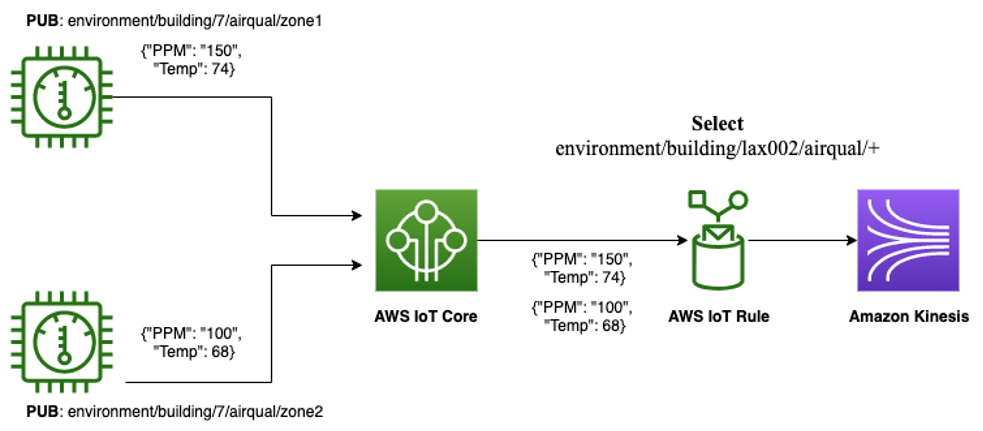

# API Design

## Application API
We will use REST API for application's side API. In the following section will be the 
draft API endpoint with a data schema if needed.
```typescript
interface ExampleSchema {
    a: string   // required field 'a' with type 'string'
    b?: number  // optional field 'b' with type 'number'
}
```

### Social API
#### Retrieving data
`GET /api/self` will return the user info of the caller (`User`)

`GET /api/users/{communityId}` will return a list of users in a community
```typescript
interface User {
    firstname: string
    lastname: string
    nickname: string
    gender: string
    location: Location
    profilePicture: string // URL of the image
}

inteface Users {
    data: User[]
    pagination: {
        next?: string
        prev?: string
    }
}
```

`GET /api/explore` will return a recommended paginated list of communities

`GET /api/communities` will return a paginated list of communities
```typescript
interface Community {
    thumbnail: string // URL of the image
    name: string
    description: string
    members: number
    likes: number
    posts: number
}

interface Communities {
    data: Community[]
    pagination: {
        next?: string
        prev?: string
    }
}
```

`GET /api/posts` will return a paginated list of posts 
- Use this on both global feed and community feed
- Event is also a post, we can get only the events by specify `isEvent=true`

```typescript
interface EventPost {
    owner: string
    images?: string[] // URL of the image 
    header: string
    description: string
    joined: number
    datetime: DateTime
}

interface Post {
    owner: string
    images?: string[] // URL of the image 
    header: string
    description: string
    likes: number
}

interface Posts {
    data: Post[] | EventPost[]
    pagination: {
        next?: string
        prev?: string
    }
}
```

`GET /api/user` will return the user information
```typescript
interface User {
    profileImage: string // URL of the image
    name: string
    role: string
}
```

#### Creating data
`POST /api/signup` for creating a new user
```typescript
interface NewUser {
    username: string
    phone: string
    birhday: Date
    email: string
    password: string
    confirmPassword: string
}
```


`POST /api/communities` for creating a new community
```typescript
interface NewCommunity {
    thumbnail: string // URL of the image
    name: string
    description: string
}
```

`POST /api/posts` for creating a new post
```typescript
interface NewPost {
    images?: string[] // URL of the image 
    header: string
    description: string
    isEvent: boolean
    datetime?: DateTime // only use this if isEvent is true
}
```

#### Mutating data
`PUT /api/self` for updating the user information
```typescript
interface UpdateUser {
    firstname: string
    lastname: string
    nickname: string
    gender: string
    location: Location
}
```

`PUT /api/self/pic` for updating the user profile picture
```typescript
interface UpdateUserProfilePic {
    profilePicture: string // URL of the image
}
```

`DELETE /api/communities/{id}` for deleting a community

`DELETE /api/posts/{id}` for deleting a post

`PUT /api/communities/{id}` for editing a community

```typescript
interface UpdateCommunity {
    thumbnail?: string // URL of the image
    name?: string
    description?: string
}
```
`PUT /api/posts/{id}` for editing a post

```typescript
interface UpdatePost {
    images?: string[] // URL of the image 
    header?: string
    description?: string
    isEvent?: boolean
    datetime?: DateTime // only use this if isEvent is true
}
```

### Pet API

#### Retrieving data
`GET /api/pets` will return a list of pets of a certain user
```typescript
interface Pet {
    image: string
    breed: string
    color: string
    dateOfBirth: Date
    gender: 'Male' | 'Female'
    weight: number
    isSterilized: boolean
}

interface Pets {
    data: Pet[]
    pagination: {
        next?: string
        prev?: string
    }
}
```

`GET /api/pets/location` will return a gps location of the pet (both lost and not lost)
```typescript
interface PetLocation {
    current: GPS
    history: GPS[]
}
```

`GET /api/pets/health` will return the health information of certain pet
```typescript
interface PetHealth {
    heartrate: number
    calories: number
    rest: number
    healthrecords: {
        datetime: DateTime
        content: string
    }[]
}
```

`GET /api/pets/health/mood` will return mood histort of the pet
```typescript
interface PetMood {
    data: { datetime: DateTime, value: MoodValue }[]
    summary: [MoodValue, number][]
}
```

`GET /api/pets/health/heartrate` will return heart rate history of the pet
```typescript
interface PetHeartRate {
    range: [number, number]
    restingHeartRate: number
    data: { datetime: DateTime, value: number }[]
}
```

`GET /api/pets/health/calories` will return calories history of the pet
```typescript
interface PetCalories {
    data: { datetime: DateTime, value: number }[]
}
```

`GET /api/pets/health/rest` will return reset history of the pet
```typescript
interface PetRest {
    data: { datetime: DateTime, value: number }[]
}
```

`GET /api/pets/vaccines` will return a list of vaccines that a pet has
```typescript
interface Vaccine {
    date: Date
    description: string
}

interface Vaccines {
    data: Vaccine[]
    pagination: {
        next?: string
        prev?: string
    }
}
```

#### Creating data
`POST /api/pets` for adding a new pet
```typescript
interface NewPet {
    image: string
    breed: string
    color: string
    dateOfBirth: Date
    gender: 'Male' | 'Female'
    weight: number
    isSterilized: boolean
}
```

`POST /api/pets/health/record/{petname}` for adding a new health record to certain pet
```typescript
interface NewPetHealthRecord {
    datetime: DateTime
    content: string
}
```

`POST /api/pets/vaccines/{petname}` for adding a new vacccine to certain pet
```typescript
interface NewVaccine {
    date: Date
    description: string
}
```

#### Mutating data
`PUT /api/pets/{petname}` for editing a pet information
```typescript
interface UpdatePet {
    image?: string
    breed?: string
    color?: string
    dateOfBirth?: Date
    gender?: 'Male' | 'Female'
    weight?: number
    isSterilized?: boolean
}
```

`PUT /api/pets/health/record/{petname}/{id}` for editing a certain pet's health record
```typescript
interface UpdatePetHealthRecord {
    datetime?: DateTime
    content?: string
}
```

`PUT /api/pets/vaccines/{petname}` for editing a certain pet's vaccine
```typescript
interface UpdateVaccine {
    date?: Date
    description?: string
}
```

### Collar API 
From ChatGPT
> MQTT, or Message Queuing Telemetry Transport, is a lightweight and open-source messaging protocol 
> designed for efficient communication between devices in a distributed and resource-constrained network. 
> It follows a publish-subscribe model, allowing devices to publish messages to specific topics, and other devices
> to subscribe to those topics to receive relevant information. MQTT is known for its simplicity, 
> low bandwidth usage, and support for unreliable or intermittent networks. It is widely used in 
> Internet of Things (IoT) applications, where devices need to exchange data in a scalable 
> and reliable manner. MQTT's design makes it suitable for scenarios where low latency and 
> minimal network overhead are essential, making it a popular choice for various IoT implementations.


We will use "Fan-In" pattern as stated on this
[article](https://docs.aws.amazon.com/whitepapers/latest/designing-mqtt-topics-aws-iot-core/mqtt-communication-patterns.html#fan-in)
from AWS.



Collar will have this topic schema `collar/{cat | dog}/{deviceId}` 
e.g. `collar/cat/fed38152-6595-48c1-aaea-ebc0d937a19d` and the payload will look like this

```  
{
   gps: GPS[]               // every 5min gps location with timestamp 
   sound: SoundWaves[]      // the sound recorded in this period
   heartrate: HeartRate[]   // every 10s heartrate with timestamp
}
```
Then we will publish this to the broker every 5 minutes using Qos 1 (at least once).
