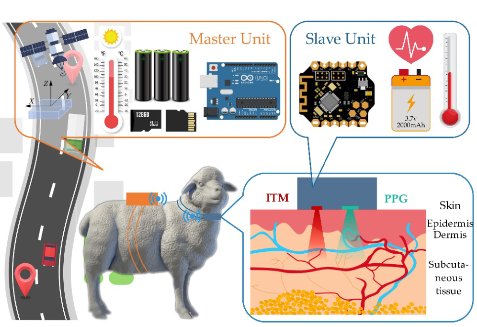
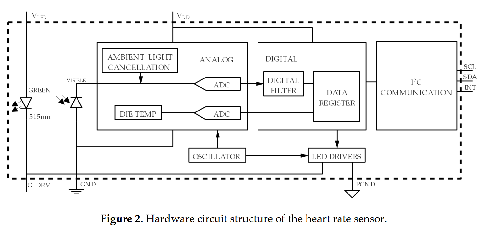
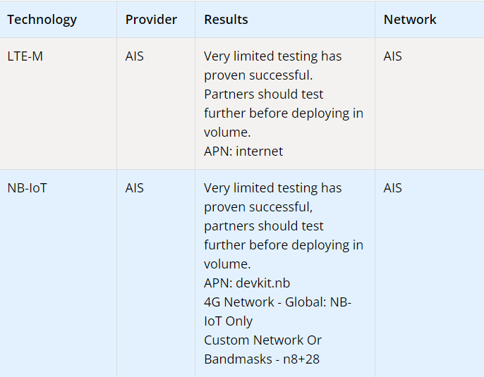
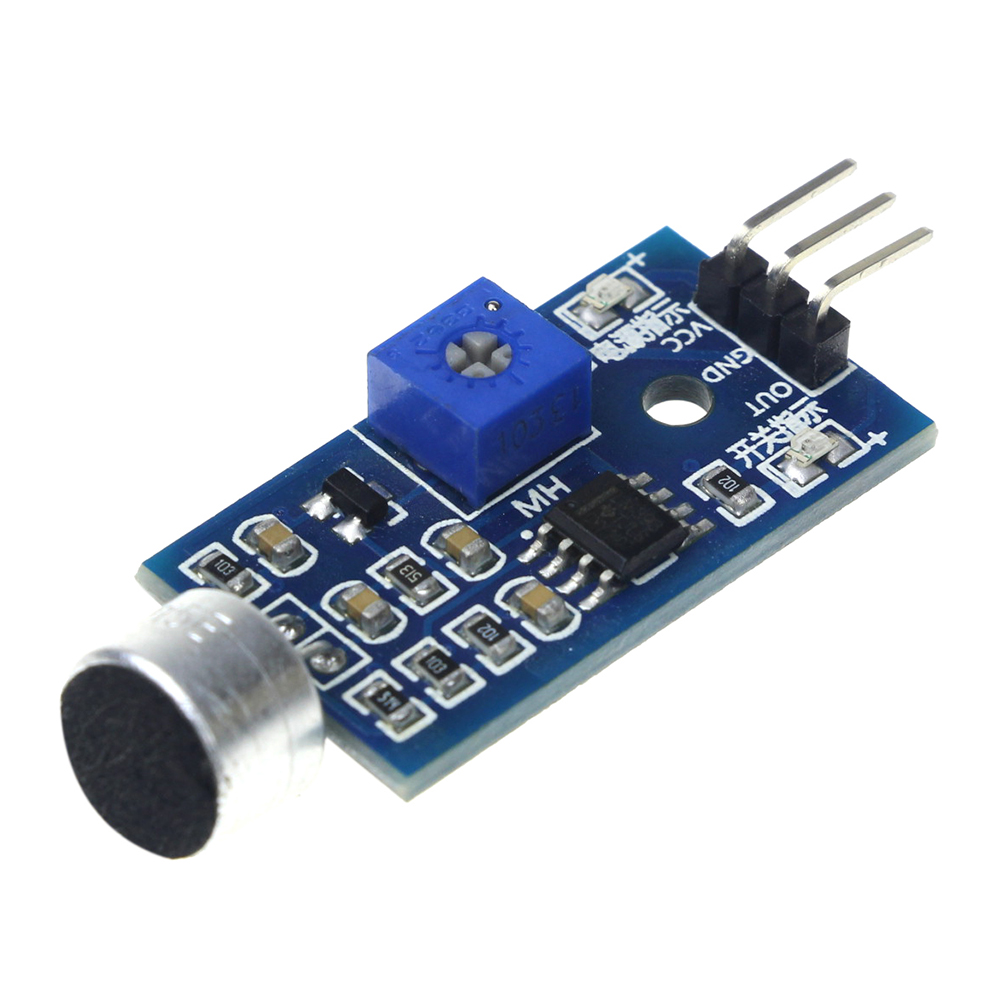
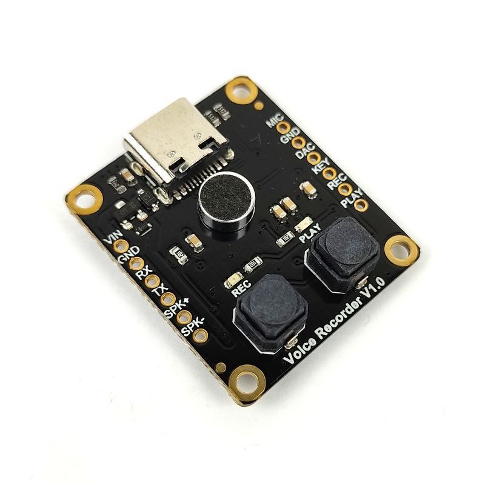
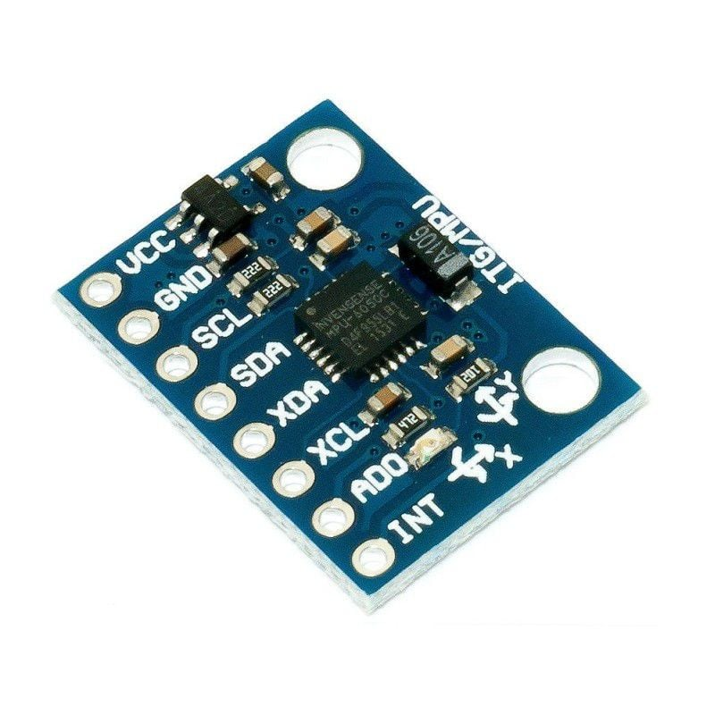

# Collar Design

## Basic Requirements

We want a small box that will be attached to the dog or cat collar. So

- It should be small and light as much as possible (weight <50g, should not be bigger than 80 · 30 · 20 mm)
- Long lasting battery (minimum >24 hours)
- Can alway connect to the internet (>95% of the battery time)
- Every sensors will be integrated into the box. (We need to build a custom PCB)
- Waterproof

## Sensor Specs

### Heart Rate
From this [Article | ECG vs PPG for heart rate monitoring](https://neurosky.com/2015/01/ecg-vs-ppg-for-heart-rate-monitoring-which-is-best/)
- **PPG (photoplethysmography) use a light-based technology to sense the rate of blood flow.**
- ECG (electrocardiography) measure the electric signal generated from the heart.

#### **Dealing with Dog and Cat fur**

**from this** [**Research | IoT for Living Sheep.**](https://www.researchgate.net/publication/332477439_WSMS_Wearable_Stress_Monitoring_System_based_on_IoT_Multi-Sensor_Platform_for_Living_Sheep_Transportation)

- For convenient wearing and high reliability PPG sensor type is better.
- They measure pulse and blood oxygen saturation by using sheep tissue to cause different light transmittance when the blood vessels beat.
- The heart rate sensor is composed of light source (they use green LED because the absorption characteristics of hemoglobin.) and photoelectric converter.
- They emitted green LED captured light signal then converted into an electrical signal, amplified, and outputted

> *Since this method works on animals like sheep, which have thick fur, as well as dogs and cats, it is an interesting method to use.* 

#### **Structure of PPG Heart Rate Sensor**

- LED Chip AM2520 (Green)
- Optical Receiver Chip APDS-9008
- Electrical Signal Amplifier

 

>
<!-- ^ This is for end line beautifully. -->

### GPS / LTE

SIM7080G NB-IoT / Cat-M / GNSS (This can also provide GPS)

**Specs**

- SIM Card 1x slot
- GNSS positioning (GPS, GLONASS, BeiDou, and Galileo)
- Data rate
    - Cat-M (LTE-M): Uplink 1,119 Kbps, Downlink: 589 Kbps
    - NB-IoT: Uplink 150 Kbps, Downlink: 136 Kbps

**SIM Provider in Thailand**

#### Data usage Assumption (1 Collar in 1 Day)

Uploading datas from Collar's sensors to Data Center.

**Voice** 

- Voice record length 10 seconds + MQTT Struct = ~70 KB
- Around 10 Voice records upload per day
- Voice Data Usage (per day) = 70KB x 10 = ~700 KB

**Heart Rate**

- Heart rate payload + MQTT Struct = ~20 Bytes
- Heart rate data updates every 10 seconds
- Heart rate Data Usage (per day) = 20B x 8,640 = ~172 KB

**GPS Position**

- GPS Position payload + MQTT Struct = ~50 Bytes
- GPS Position updates every 5 minutes
- GPS Position Data Usage (per day) = 50B * 288 = 14.4 KB

**Accelerometer**

`todo!()`

**Battery**

`todo!()`

**Summary Data Usage Assumption**

- `todo!()`

 

>
<!-- ^ This is for end line beautifully. -->

### Microphone

For recording pet's voice then send to ML server to classified pet's emotional.

**Voice Sound Detection Sensor Module**

This is for triggering the voice recorder module for recording pet's voice, Since We don't want to record all the time.

**Fermion: Voice Recorder Module**

This is the voice recorder module for recording pet's voice.

**Specs**

- Sampling Rate: 48kbs
- Frequency Response: 20-20KHz
- Storage: 16MB
- Support about 40 minutes voice recording

Interesting Link
- High Sensitive Microphone Module
- Fermion: Voice Recorder Module 
- [Electro-magnetic microphone (MEM)](https://youtu.be/wQkrD2D-XFA?si=1bjIS1xrrbElS7r1)
- https://academic.oup.com/cz/article/67/2/165/5892256
- https://www.lsu.edu/deafness/HearingRange.html
- https://www.ncbi.nlm.nih.gov/pmc/articles/PMC7000907/#:~:text=Cat%20vocalizes%20to%20communicate%20with,contains%20more%20types%20of%20vocalizations.
- https://www.quora.com/What-is-the-vocal-range-of-cats-by-frequency

 

>
<!-- ^ This is for end line beautifully. -->

### Accelerometer
For tracking pet's activity, movement.

**Accelerometer/Gyro Module (MPU6050)**

**Specs**

- 3-axis accelerometer (x, y, z)
- 3-axis gyroscope (x, y, z)
- In-built Temperature sensor

 

>
<!-- ^ This is for end line beautifully. -->

### Processor

**Raspberry Pi Pico**

The Raspberry Pi Pico is a microcontroller board, and its features are tailored towards specific use cases where a compact, low-cost, and power-efficient solution is required.

[Brief Overview](https://datasheets.raspberrypi.com/pico/pico-product-brief.pdf), 
[Datasheet](https://datasheets.raspberrypi.com/pico/pico-datasheet.pdf)

 

>
<!-- ^ This is for end line beautifully. -->

### Battery

**Lithium Polymer (LiPo)** Battery type.

**Advantages**
- LiPo battery is flexible and can be manufactured in various shapes and size, This flexibility makes them suitable for applications where space is limited.
- High energy density meaning they can store more energy in a given volume or weight.

> *Since our collar must be small, lightweight and space is limited. From the advantages of LiPo batteries that can hold a lot of energy and can change shape Therefore it seems like a good option to use.*

**The battery model we are interested in**

- **YDL 3.7V 1000mAh 503450 Lipo Battery Rechargeable Lithium Polymer x 2**
    - Voltage: DC 3.7V; Capacity: 1000mAh
    - Material: Lithium Polymer; Net Weight: 22g
    - Size: 50 x 34 x 6mm / 1.97" x 1.34" x 0.24" (LWT)

**Power assumption**

- Raspberry Pi Pico: ~50mA (Active), 
- Accelerometer/Gyro Module: ~4mA (Active)
- Voice Sound Detection Sensor Module: ~5mA (Active)
- Voice Recorder Module: 15mA (Active)
- SIM7080G NB-IoT / Cat-M / GNSS: 15mA (Active)
- PPG Heart Rate Sensor: 5mA (Active)
- Sleep mode (PICO/SIM/GPS): 30mA (Sleep)

\\( P_{\text{active}} = 50 + 4 + 5 + 15 + 15 + 5 = 94 \ \text{mA} \\) and \\( P_{\text{sleep}} = 30 \ \text{mA} \\)

\\( T_{\text{active}} = 0.8 \\) (80% active time) and \\( T_{\text{sleep}} = 0.2 \\) (20% sleep time)

\\[ \text{Average Power Consumption} = (P_{\text{active}} \times T_{\text{active}}) + (P_{\text{sleep}} \times T_{\text{sleep}}) \\]
\\[ \text{Average Power Consumption} = (94 \ \text{mA} \times 0.8) + (30 \ \text{mA} \times 0.2) \\]

Now, calculate the battery life:

\\[ \text{Battery Life (hours)} = \frac{C_{\text{battery}}}{\text{Average Power Consumption}} \\]

Substitute the given values and adjust for two batteries:

\\[ \text{Battery Life (hours)} = \frac{2000 \ \text{mAh}}{(0.8 \times 94 \ \text{mA} + 0.2 \times 30 \text{mA})} \\]

\\[ \text{Battery Life (hours)} = \frac{2000 \ \text{mAh}}{81.2 \ \text{mA}} \approx 24.6 \ \text{hours} \\]

> *Which include of power saving mode these batteries can supply our collar's sensors for at least 24hrs.*

 

>
<!-- ^ This is for end line beautifully. -->

## Software Requirements 
- Can use MQTT to send the data to the server every 5 minutes. (QOS 1, at least once)
- Trigger the microphone to record the sound when there's a sound that exceed the threshold
- Store the GPS data every 5 minutes.
- Store the heart rate data every 10 seconds.
- Can go in power save mode, when the pet is lost (only sending GPS data)
