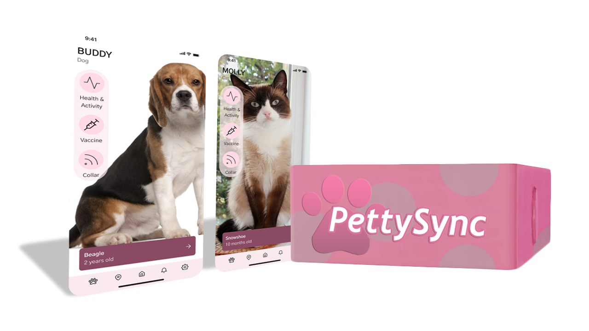

# 🐶 PettySync

**PettySync** is a smart pet collar that can help you track your pet's location and health such as mood, activity, sleep, and there is also a social community of people who use this collar. which can organize activities together Talk and exchange to make raising your pets better.

#### Problems solved with our product

* Unable to track pets during the day
* Concerned about your pet's well-being during the day
* It is not possible to detect the pet's unexpressed abnormalities.
* Inability to recognize pet's needs.
* Unable to find lost pets.

*
This report is part of the Advance Computer Engineering Technology (266-261405) course.
*