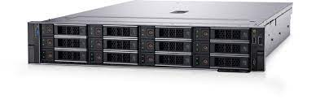
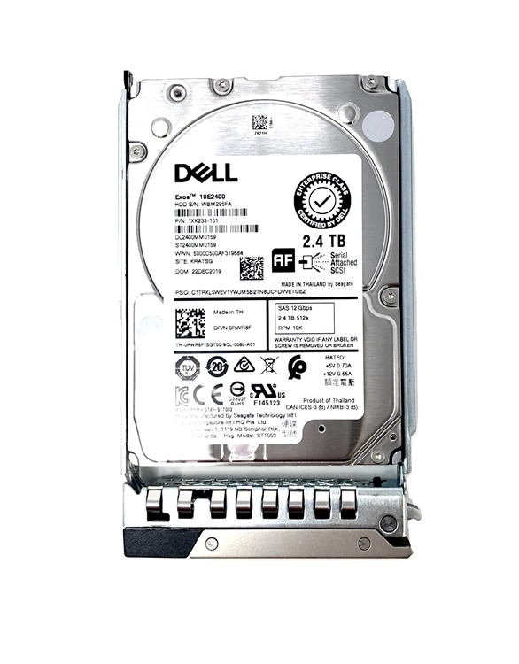
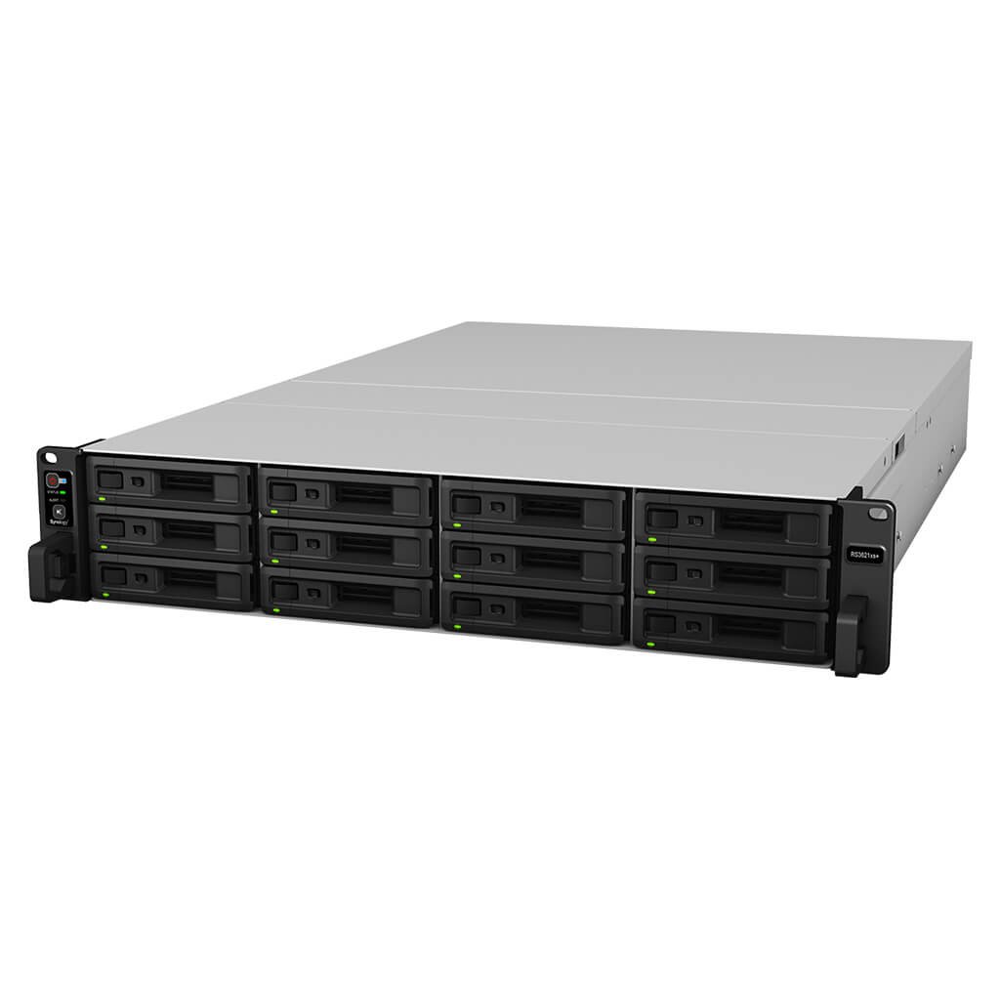
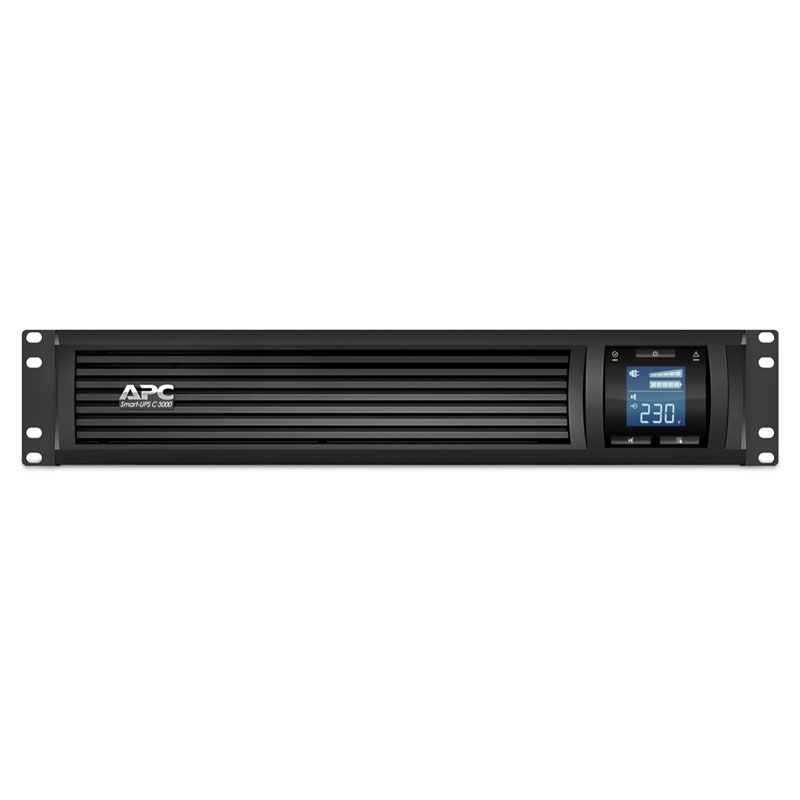

# Datacenter Devices
List of datacenter devices.

**Section**

- [Server](#server)
- [Hard Drive](#hard-drive)
- [NAS Storage](#nas-storage)
- [UPS](#ups)
- [Devices Total Cost]()

## Server

| SPECIFICATION | DETAIL |
:-: | -----------:
Model | Dell PowerEdge R750xs Specification
CPU |2 x Intel® Xeon® Silver 4314 2.4G, 16C/32T, 10.4GT/s, 24M Cache, Turbo, HT (135W) DDR4-2666
RAM | 64GB (2x 32GB) RDIMM, 3200MT/s, Dual Rank, 16Gb BASE
HDD | 4x 480GB SSD SATA Read Intensive 6Gbps 512 2.5in Hot-plug AG Drive, 1 DWPD
RAID | PERC H755 with rear load bracket
OPTICAL | No Optical Drive (Optional)
NIC | 2x 1Gb LOM + Broadcom 5720 Quad Port 1GbE BASE-T Adapter, OCP NIC 3.0
POWER | Dual, Hot-Plug, Fully Redundant Power Supply (1+1), 1100W, Mixed Mode
CHASSIS | 2U, 2.5 inch Chassis with up to 16 Hot Plug Hard Drives, Trusted Platform Module 2.0 V3, + LCD Bezel + Half Length, Low Profile, 5 x16 + 1 x4 slots, ReadyRails Sliding Rails with Cable Management Arm
MANAGEMENT | iDRAC9 Datacenter 15G with OpenManage Enterprise Advanced
Price | 240,740 BAHT
Amount | 1
Reference | https://www.quickserv.co.th/

## Hard Drive

| SPECIFICATION | DETAIL |
:-: | -----------:
Model | 2.4TB 10k 512e SAS ISE 12Gbps 2.5in Hot Plug Hard Drive
Device Type | Hard drive - hot-swap
Capacity | 2.4 TB
Form Factor | 2.5"
Interface | SAS 12Gb/s
Features | 512 emulation ( 512e )
Drive Transfer | Rate 1.2 GBps (external)
Spindle Speed | 10000 rpm
Interfaces | 1 x SAS 12 Gb/s
Compatible Bay |2.5"
Price | 16,800 BAHT
Amount | 5
Reference | https://www.dell.com/en-us/shop/24tb-10k-512e-sas-ise-12gbps-25in-hot-plug-hard-drive/apd/400-begi/storage-drives-media

## NAS Storage

| SPECIFICATION | DETAIL |
:-: | -----------:
Model | Synology 12-bay Plus series Redundant power, AMD Ryzen V1780B quad-core processor, 8GB DDR4 ECC
Processor : AMD Ryzen V1780B 64-bit 4-core 3.35 (base) / 3.6 (turbo) GHz
RAM : 8 GB DDR4 ECC UDIMM
Compatibility : 3.5″ SATA HDD, 2.5″ SATA SSD
LAN RJ-45 1GbE : 2 
LAN RJ-45 10GbE : 1
USB 3.2 Gen 1 : 2
Price | 114,300 BAHT
Amount | 1
Reference | https://itstorepro.com/synology-12-bay-rackstation-4-core-8gb-rs2423rpplus/

## UPS

| SPECIFICATION | DETAIL |
:-: | -----------:
Model | APC Smart-UPS C SMC3000RMI2U
Main Input Voltage | 230 V
Main Output Voltage |230 V
Rated power in W |2100 W
Rated power in VA |3000 VA
Price | 38,000 BAHT
Amount | 1
Reference | https://www.apc.com/th/en/product/SMC3000RMI2U/apc-smartups-c-line-interactive-3kva-rackmount-2u-230v-8x-iec-c13+1x-iec-c19-outlets-usb-and-serial-communication-avr-graphic-lcd/

## Devices Total Cost

| Device | Price | Amount | Total (฿) |
| :-: | :-: | :-: | :-: |
| Server | 240,740 | 1 | 240,740 |
| Hard Drives | 16,800 | 5 | 84,000 |
| NAS Storage | 114,300 | 1 | 114,300 |
| UPS | 38,000 | 1 | 38,000 |
|  |  |  | 477,040 |