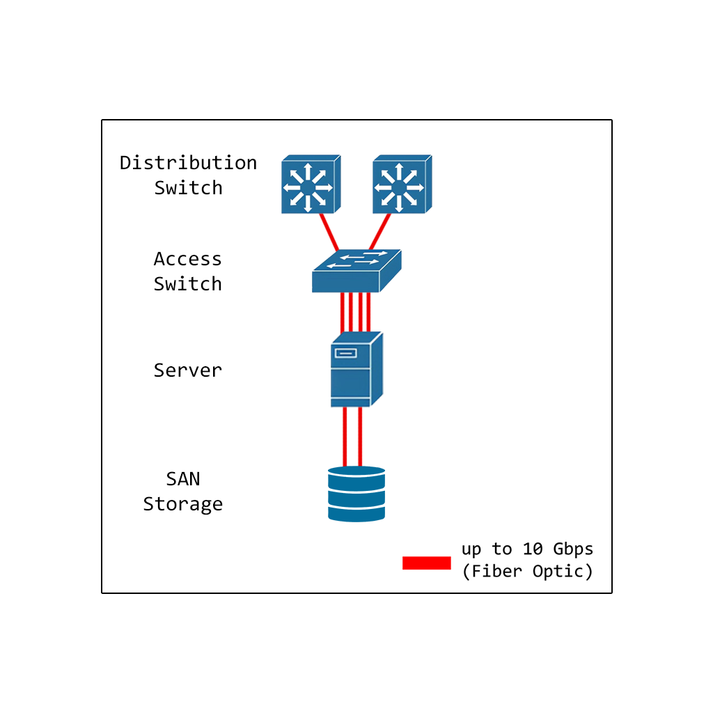
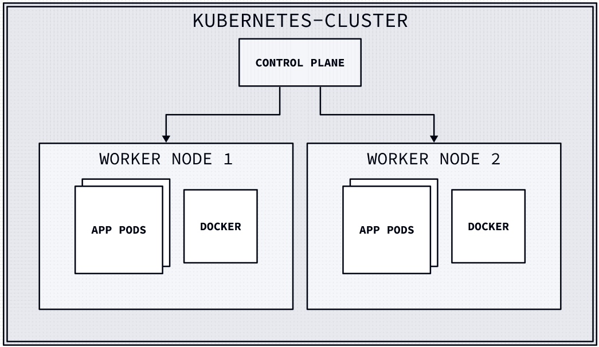

# Network for Datacenter

**Section**

- [Datacenter Network](#datacenter-network)
- [Cluster Network](#cluster-network)

## Datacenter Network

*
Network for Datacenter
*

**Network**
- The server is connected to 4 ports LAN access switch with fiber optic cables to support high bandwidth. and connected to storage with 2 LAN ports

**Datacenter devices**
- **Dell PowerEdge R750xs** is the server for the datacenter network.
- **2.4TB 10k 512e SAS ISE 12Gbps 2.5in Hot Plug Hard Drive** is the hard drive for the datacenter network.
- **APC Smart-UPS C SMC3000RMI2U** is the UPS for the datacenter network.
- **Synology 12-bay Plus series Redundant power, AMD Ryzen V1780B quad-core processor, 8GB DDR4 ECC** is the NAS for the datacenter network.

## Cluster Network
<!-- 
vars: {
  d2-config: {
    layout-engine: elk
    theme-id: 300
  }
}

kubernetes-cluster: {
  control-plane: {
    label: "Control Plane"
  }

  worker-node-1: {
    label: "Worker Node 1"
    pods: {
      shape: square
      label: "App Pods"
      style.multiple: true
    }
    docker: {shape: square; label: "Docker"}
  }

  worker-node-2: {
    label: "Worker Node 2"
    pods: {
      shape: square
      label: "App Pods"
      style.multiple: true
    }
    docker: {shape: square; label: "Docker"}
  }

  control-plane -> worker-node-1
  control-plane -> worker-node-2
}
 -->

- **Ubuntu 20.04 LTS** is the operating system for the cluster network.
- **Kubernetes** is the container orchestration platform for the cluster network.
- **Docker** is the containerization platform for the cluster network.
<!-- - **MetalLB** is the load-balancer for the cluster network. -->
