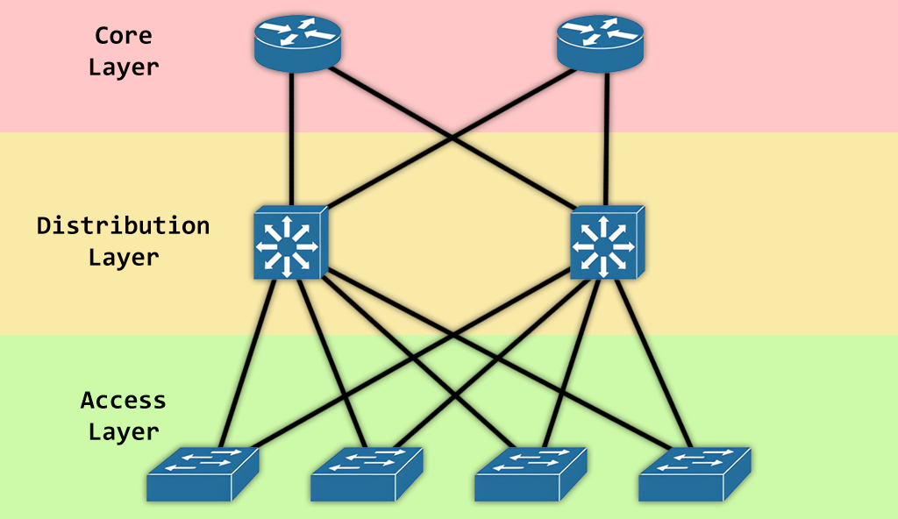

# Network Design Overview
Overview of network system design and services for both headquarter and branch.

**Section**

- [Network Services](#network-services)
- [3-Tier Topology Architecture](#3-tier-topology-architecture)

## Network Services
**Work From Home**
- Employees working from home can access the company network with a VPN.

**Branch Connection**
- Connecting between headquarter and branch with WAN Internet ISP.

**Internet**
- WLAN / LAN for every department.

**Data Center**
- For storing information in organization.

## 3-Tier Topology Architecture
The architecture used in the design is **3-tier architecture**, consisting of the **core layer**, the **distribution layer**, and the **access layer**.

*
3-Tier Network Topology Architecture
*

**Core Layer**
- Considered as the back bone of networks

**Distribution Layer**
- Works as the bidge of Access Layer and Core Layer

**Access Layer**
- Connected to the end devices (Computers, Printers, Servers etc)

**Benefits**
- **Redundancy**: Multiple links across multiple devices provides better redundancy. If one switch is down, we have another alternate path to reach the destination.
- **Scalability**: Easily expand network by connecting more access switches in access layer.