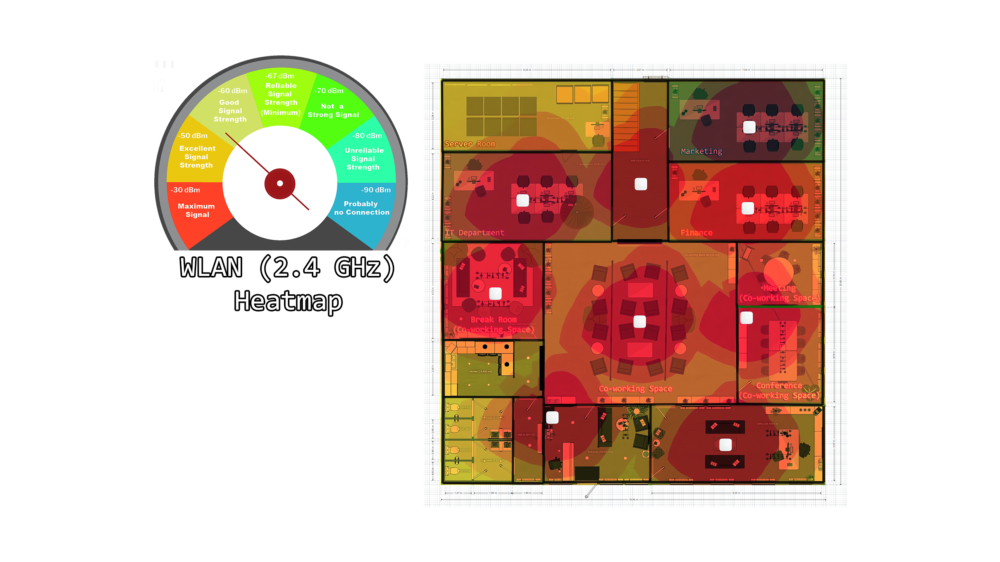
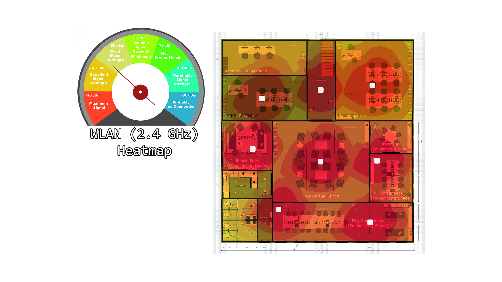
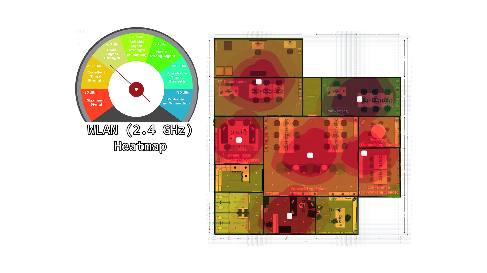

# WLAN Heatmap
The heat map shows the coverage and clarity of the 2.4 GHz wireless signal on both headquarter and branch. The signal coverage is very good.

**Section**

- [Headquarter Floor 1](#headquarter-floor-1-wlan-heatmap)
- [Headquarter Floor 2](#headquarter-floor-2-wlan-heatmap)
- [Branch](#branch-wlan-heatmap)

### 
Headquarter Floor 1 WLAN Heatmap

*
Headquarter Floor 1 WLAN Heatmap
*

### 
Headquarter Floor 2 WLAN Heatmap

*
Headquarter Floor 2 WLAN Heatmap
*

### 
Branch WLAN Heatmap

*
Branch WLAN Heatmap
*