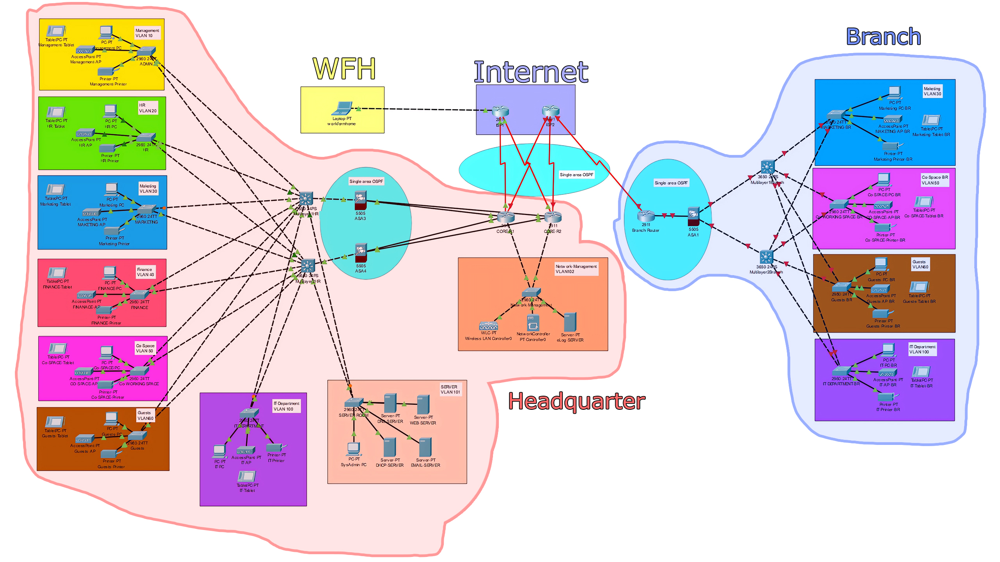

# Logical Topology

**Section**

- [Headquarter](#-headquarter)
- [Branch](#-branch)

*
Logical Network Topology of Headquarter and Branch
*

## 🔴 Headquarter

**Core Layer**
- 2 Core routers connect to the internet and network between branch via WAN provided by 2 internet service providers.
- 2 Firewalls connect to the 2 core routers and serve as a bridge between the core and distribution layers. The firewalls also configure IPSec VPN to support employees who work remotely.

**Distribution Layer**
- 2 Distribution switches to perform redundancy; if any one breaks, can use another route. This layer connects to the core layer and distributes the network to the access layer.

**Access Layer**
- Access switches for each department to connect to access points to broadcast wireless signals and supports LAN for various employee devices such as computers, printers.
- Each access switch is connected to 2 distribution switches for redundancy.

**VLAN**

| VLAN Number | VLAN Name | Subnet | Max Devices |
| :-: | :-: | :-: | :-: |
| 10 | Management | 192.168.10.0/24 | 254 |
| 20 | Human Resource | 192.168.20.0/24 | 254 |
| 30 | Marketing | 192.168.30.0/24 | 254 |
| 40 | Finance | 192.168.40.0/24 | 254 |
| 50 | Co-working space | 192.168.50.0/24 | 254 |
| 60 | Guest | 192.168.60.0/24 | 254 |
| 100 | IT Department | 192.168.100.0/24 | 254 |
| 101 | Server | 192.168.101.0/24 | 254 |
| 102 | Network Management | 192.168.102.0/24 | 254 |

## 🔵 Branch

**Core Layer**
- The core router connects to the Internet and the headquarter through an Internet service provider. And the firewall is connected to the distribution layer.

**Distribution Layer**
- 2 Distribution switches connect from the core layer to the access layer.

**Access Layer**
- Access switches for each department to connect to access points to broadcast wireless signals and supports LAN for various employee devices.
- Each access switch is connected to 2 distribution switches for redundancy.

**VLAN**

| VLAN Number | VLAN Name | Subnet | Max Devices |
| :-: | :-: | :-: | :-: |
| 30 | Marketing | 192.168.30.0/24 | 254 |
| 50 | Co-working space | 192.168.50.0/24 | 254 |
| 60 | Guest | 192.168.60.0/24 | 254 |
| 100 | IT Department | 192.168.100.0/24 | 254 |