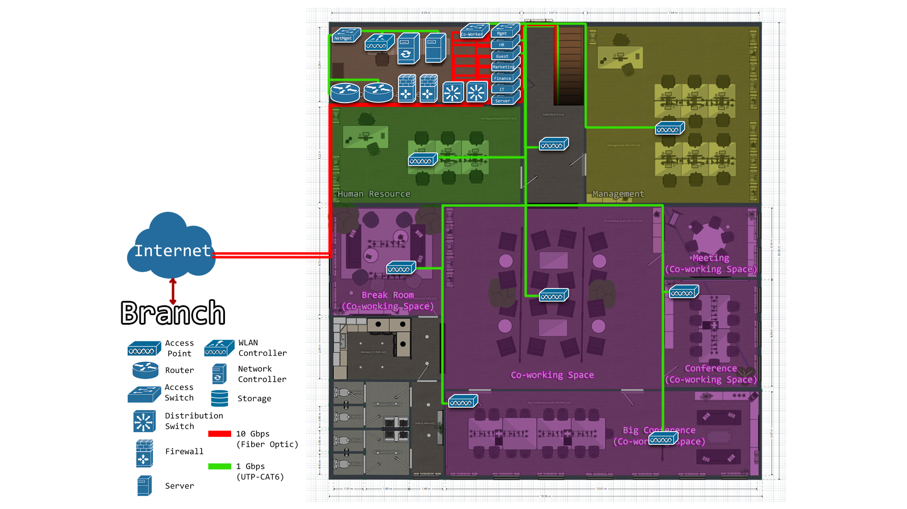

# Physical Topology

**Section**

- [Headquarter Floor 1](#headquarter-floor-1-physical-topology)
- [Headquarter Floor 2](#headquarter-floor-2-physical-topology)
- [Branch](#branch-physical-topology)

### 
Headquarter Floor 1 Physical Topology

*
Headquarter Floor 1 Physical Topology
*

- On the **first floor of the headquarter**, **equipment is mostly placed in the access layer** in various departments such as access points, servers, storage, **and routed up to the network room on the second floor**.
- **Access points** will be connected with a **CAT6 cables (green line)** that can support speeds of **up to 1 Gbps**.
- **Servers and storage**, are connected with fiber **optic cables (red line)**. That supports speeds **up to 10 Gbps**.

### 
Headquarter Floor 2 Physical Topology

*
Headquarter Floor 2 Physical Topology
*

- **Almost all network devices in the core layer, distribution layer Installed in the network room on the 2nd floor** and routed to the equipment in the access layer. Distributed to various departments on both floors 1 and 2.
- 2 **core routers connected to internet service providers** And **devices that require high bandwidth** such as firewalls, distribution switches and access switches are **connected with fiber optic cables (red line)**.

### 
Branch Physical Topology

*
Branch Physical Topology
*

- Since the branch has only 1 floor, network equipment is installed in the IT department. The **devices in the core layer, distribution layer, and access switches that require high bandwidth are connected with fiber optics (red line)**. As for **access points** distributed in various departments, they will be **connected with CAT6 (green line)**. Same as headquarter.