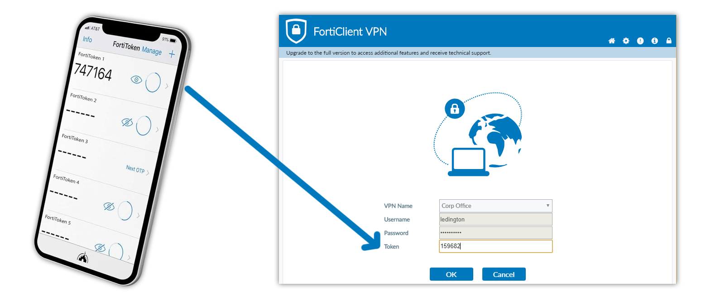
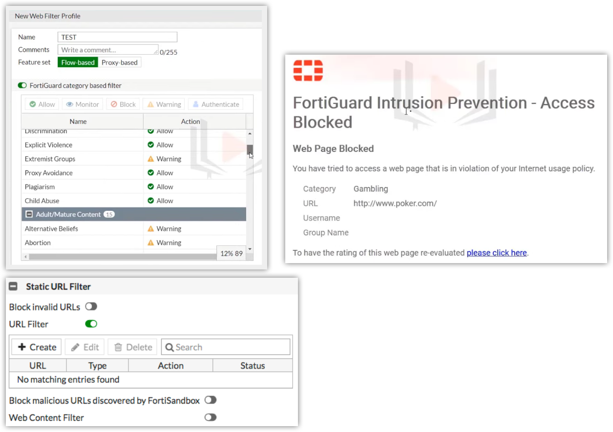

# Security Policy
Security policies that help increase internet security for employees.

**Section**

- [VPN 2-Factor Authentication](#headquarter-floor-1-wlan-heatmap)
- [Web Filtering](#headquarter-floor-2-wlan-heatmap)

## VPN 2-Factor Authentication

*
FortiToken Mobile and FortiClient VPN
*
For employees who need to connect to VPN Must install FortiClient VPN, FortiToken Mobile.
- **FortiClient VPN** is used to connect to a VPN where each employee must enter a username, password and token (one-time password) in order to connect.
- **FortiToken Mobile** for receiving token (one-time password) via phone.

## Web Filtering

*
Web Filtering setup in Firewall
*
- **Block websites** that fall into unwanted categories, such as websites with **dangerous content**, gambling websites, etc.
- **Block malicious URLs** that may be viruses.
