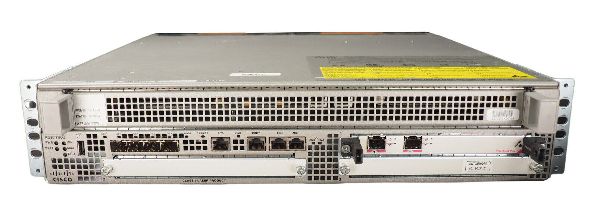
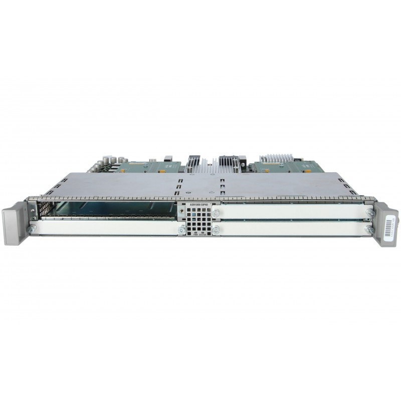
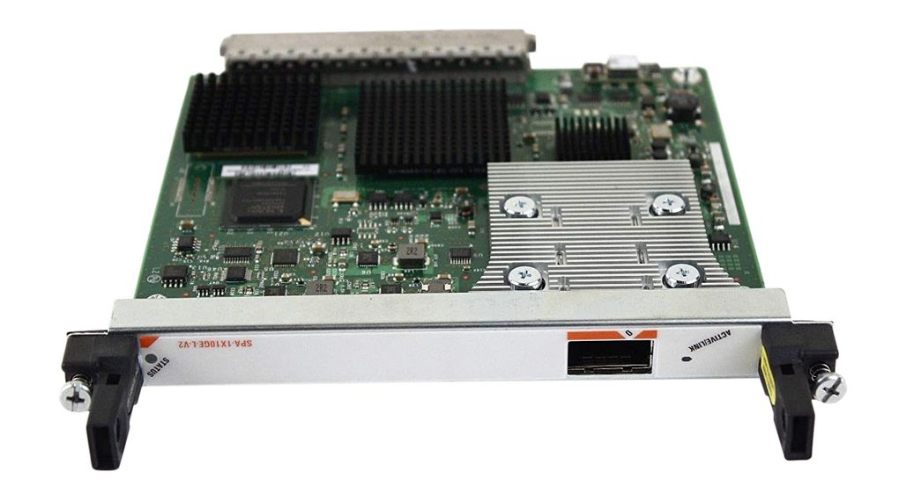
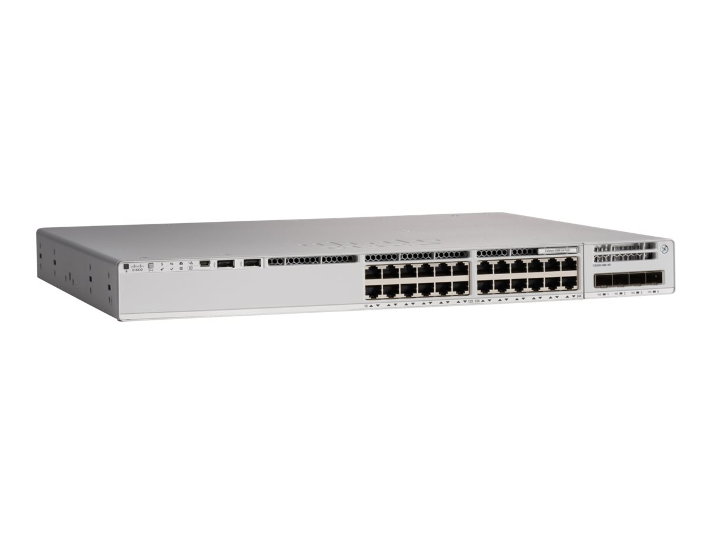
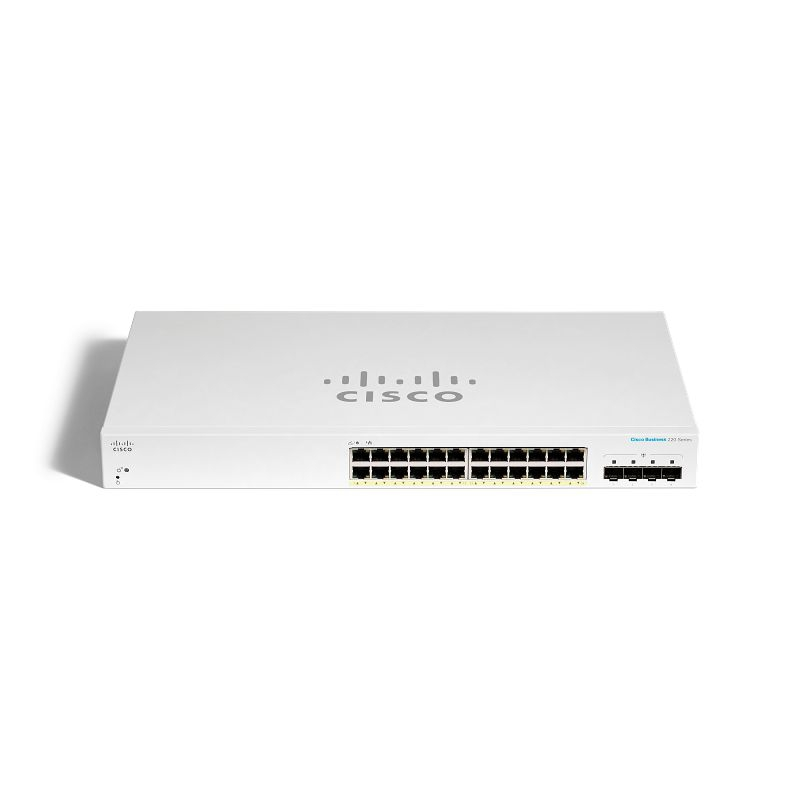
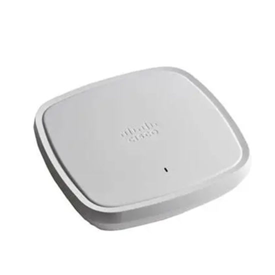
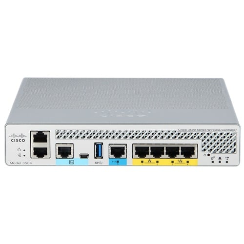

# NETWORK DEVICE

# Core Router

| SPECIFICATION | DETAIL |
:-: | -----------:
Model | Cisco ASR 1002-X
Rack Height | 2RU
System Bandwidth | 5G (default) / 10G, 20G,36G (upgrade)
Router Processor (RP) | Dual-core 2.13Ghz processor
Build-in Gigabit Ethernet port | 6 x SFP ports
Redundancy | Software (license purchase separately)
Cisco ASR 1000 Series ESP | 1 ESP slot
SIP and Ethernet line card | Integrated ASR 1000-SIP10, not upgradable
Rack-mounting | 19-inch
DRAM Memory | 4GB-shared across RP, ESP, and SIP
Flash Memory | 8 GB
Shared port adapters | 3 SPA slots
External USB flash memory | 4-GB USB flash-memory support
Price | 35,000 BAHT
Amount | 3
Reference | https://www.andovercg.com/datasheets/cisco-asr1000-aggregation-routers-2.pdf

| SPECIFICATION | DETAIL |
:-: | -----------:
Model | ASR1002-SIP40
Device Type | Expansion module
Form Factor | Plug-in module
Expansion Slots | 4 (total) / 4 (free) x expansion slot
Compatible Slots | 1 x expansion slot
Width | 16.7 in
Depth | 14.2 in
Height | 1.6 in
Weight | 3.9 kg
Price | 33,700 BAHT
Amount | 3
Reference | https://www.cisco.com/c/en/us/products/collateral/routers/asr-1000-series-aggregation-services-routers/datasheet-c78-731632.html

| SPECIFICATION | DETAIL |
:-: | -----------:
Model | SPA-1X10GE-L-V2
Product Compatibility | Cisco ASR 1000 Series Router and others
Port Density per SPA | One 10 Gigabit Ethernet port
Physical Interface | 10-Gbps XFP optics
Features and Functions | 
1 | Full-duplex operation
2 | Up to 8000 VLANs per SPA
3 | Bridge protocol data unit (BPDU), Cisco Discovery Protocoland VLAN Trunking Protocol (VTP) filtering
Width | 17.15 cm
Depth | 18.49 cm
Height | 2.03 cm
Weight | 0.34 kg
Price | 5,500 BAHT
Amount | 12
Reference | https://www.cisco.com/c/en/us/products/collateral/interfaces-modules/shared-port-adapters-spa-interface-processors/product_data_sheet0900aecd804dc62d.html

# Network Devices

| SPECIFICATION | DETAIL |
:-: | -----------:
Ports | 24 ports full PoE+ (8 mGig ports up to 10G, 16 ports up to 1G)
Switching capacity |  352 Gbps
Price | 120,000 BAHT
AMOUNT | 12
Reference | https://www.cisco.com/c/en/us/products/collateral/switches/catalyst-9200-series-switches/nb-06-cat9200-ser-data-sheet-cte-en.html

| SPECIFICATION | DETAIL |
:-: | -----------:
Model | Cisco CBS220-24T-4X-EU-1
Port Configuration | 24 ports (1 Gigabit Ethernet)
Additional Ports | 4 ports 10 Gigabit Ethernet ports (4X)
Power over Ethernet (PoE) | Supports PoE+ (Power over Ethernet Plus)
Price | 14,200 BAHT
AMOUNT | 13
Reference | https://www.cisco.com/c/en/us/products/collateral/switches/business-220-series-smart-switches/datasheet-c78-744915.html

| SPECIFICATION | DETAIL |
:-: | -----------:
Model | C9105AXI-EWC-S
Interface |	1x 100, 1000, 2500, 5000 Multigigabit Ethernet (RJ-45)
Radios |
1|802.11n version 2.0 4x4 MIMO with four spatial streams PHY data rates up to 1.5 Gbps
2|802.11ac 8x8 downlink MU-MIMO with eight spatial streams PHY data rates up to 3.4 Gbps
3|802.11ax 8x8 uplink/downlink MU-MIMO with eight spatial streams PHY data rates up to 5.38 Gbps
Power Consumption	| 25.5W
Dimensions (W x D x H) | 9.17 x 9.17 x 1.58 in.
Weight | 1.71 kg
Price | 9,500 BAHT
AMOUNT | 22
Reference |https://itk.co.th/access-point/cisco-access-point/cisco-aironet/c9105axi-ewc-s

| SPECIFICATION | DETAIL |
:-: | -----------:
Model | AIR-CT3504-K9
Ports | 4
Data Link Protocol | Ethernet, Fast Ethernet, Gigabit Ethernet, IEEE 802.11b, PPP, IEEE 802.11a, IEEE 802.11g, 10 Gigabit Ethernet, IEEE 802.11n, IEEE 802.11ac Wave 2, IEEE 802.11ac Wave 1
Performance Throughput | 4 Gbps
Capacity Maximum number of access points| 150 ¦ Maximum number of clients: 3000 ¦ VLANs supported: 4096
Power Over Ethernet (PoE) | Supported PoE
Power | AC 120/230 V (50/60 Hz)
Dimensions (WxDxH) | 4.394 cm x 34.13 cm x 21.59 cm
Weight | 2 kg
Price | 75,000 BAHT
AMOUNT | 1
Reference |https://itk.co.th/access-point/cisco-access-point/cisco-wireless-controller/air-ct3504-k9

| SPECIFICATION | DETAIL |
:-: | -----------:
Model | Fortinet FortiGate 120G
Ports |Gigabit Ethernet 20 Ports ¦ 10 Gigabit Ethernet 4 Ports 
Firewall Throughput | (1518 / 512 / 64 byte UDP packets): 39 / 39 / 28 Gbps
IPsec VPN Throughput (512 byte)| 35 Gbps
Price | 165,500 BAHT
AMOUNT | 3
Reference | https://www.fortinet.com/content/dam/fortinet/assets/data-sheets/fortigate-120g-series.pdf

# TOTAL COST

2677200 BAHT

