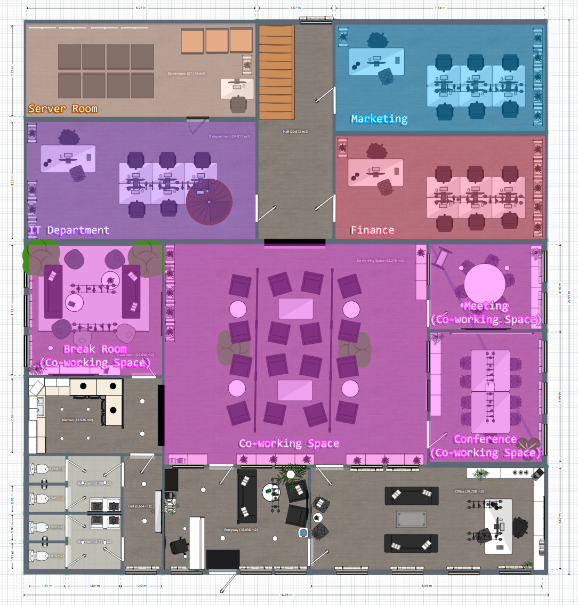
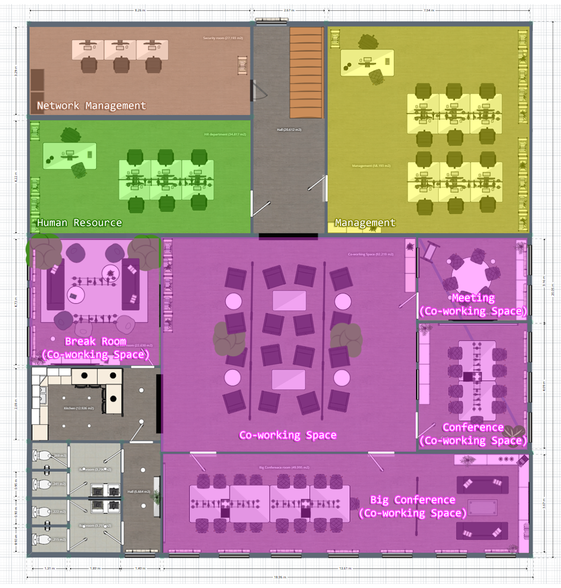
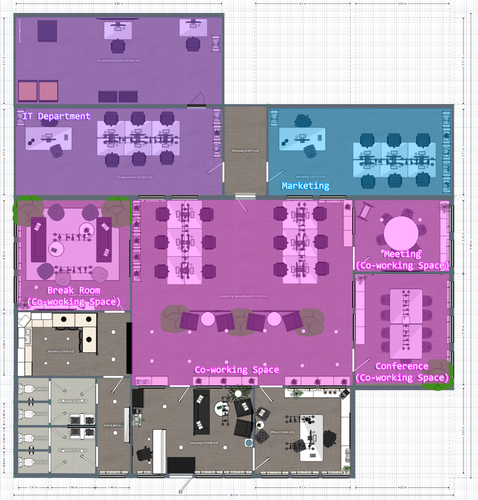

# Floorplan

Floorplans of PettySync's Headquarter and branch.

### 
Headquarter Floor 1

The first floor of headquarter is divided into **six** sections:
1. Server Room
    - For installing data center equipment and servers. 
2. IT Department
    - For IT department employees.
3. Marketing
    - For Marketing department employees.
4. Finance
    - For Finance department employees.
5. Co-working Space
    - For Supports working together and relaxing for employees in every department.
6. Guest (non-color-area)
    - General guest reception area.

### 
Headquarter Floor 2

The second floor of headquarter is divided into **four** sections:
1. Network Management
    - For installing and controlling network equipment.
2. Human Resource
    - For Human Resource department employees.
3. Management
    - For Management department employees.
4. Co-working Space
    - For Supports working together and relaxing for employees in every department.

### 
Branch

The branch floorplan is divided into **four** sections:
1. IT Department
    - For IT department employees and installing network equipment.
2. Marketing
    - For Marketing department employees.
3. Co-working Space
    - For Supports working together and relaxing for employees in every department.
4. Guest (non-color-area)
    - General guest reception area.