# MACHINE LEARNING DESIGN
Overview of  machine learning and training model frame work.

<!-- 

**Section**

- [ 
-  

 -->

## Data set

**kaggle.com**
- https://www.kaggle.com/code/gleblevankov/meow-meow
- This dataset, composed of 440 sound recordings, contains meows emitted by cats in different contexts. Specifically, 21 cats belonging to 2 breeds (Maine Coon and European Shorthair) have been repeatedly exposed to three different stimuli that act as labels for prediction:

**Cat sound**
 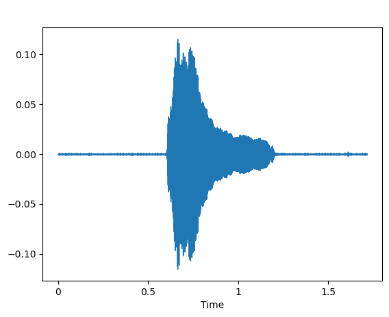
 
- Example Sound of Hungry cat.
 

Sound wave hungry
 

  Mel frequency cepstrum coefficient

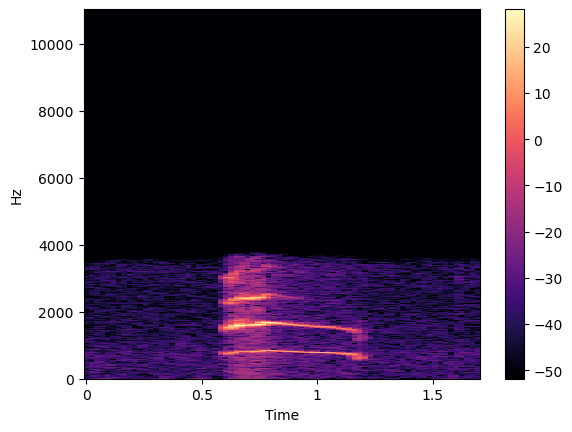

 
 

- Example Sound of Isolated cat.

Sound wave Isolated
 

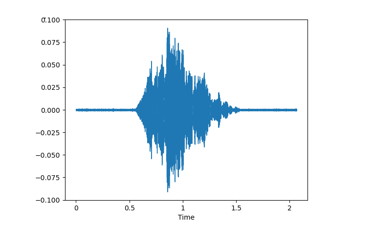

  Mel frequency cepstrum Isolated

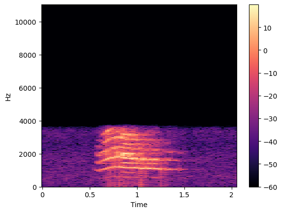

 

- Example Sound of Happy cat.

Sound wave Happy
 

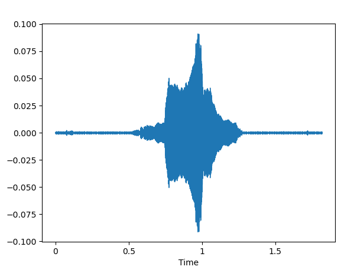

  Mel frequency cepstrum Happy

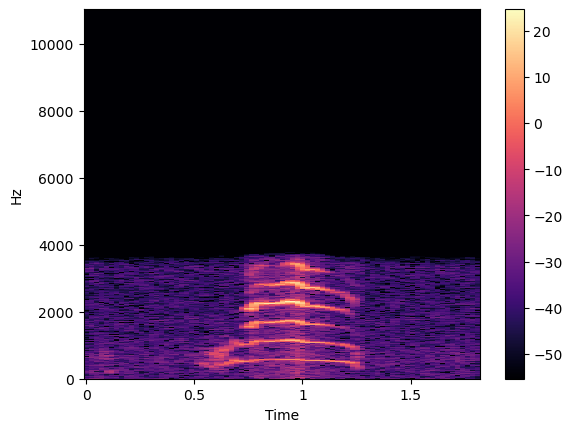

 

**Features Extraction form Cat sound**
- We can extract features from sound wave by splitting the audio into short segments to obtain a sequence of frequency spectra, each covering only a small slice of time, and stack the resulting spectra together into a spectrogram.
- This spectrogram plots the frequency content of an audio signal as it changes over time.
 
*
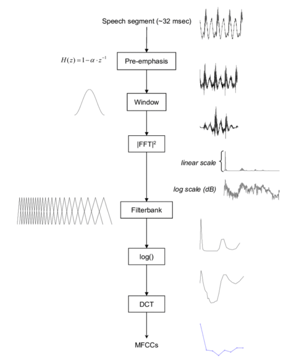
*
-  Mel frequency cepstrum 
-  Mel frequency cepstrum coefficient

**Features Extraction from Cat sound**
 
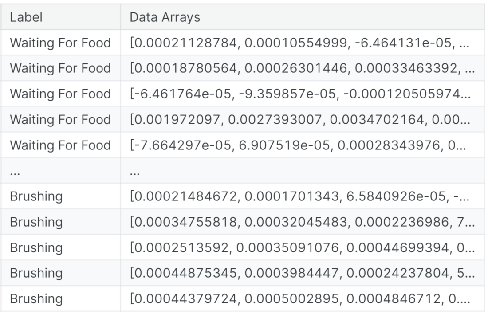

## Model Classification Architecture
- Considered as the back bone of Classification
The architecture used in the Model is **Convolutional Neural Network**, with receive  **Mel frequency cepstrum coefficient**,for input Dimension **160 * 120**, and feedforward to **Convolution , pooling**  and **Fully Connected weight** layer for Classification by 3 output node.

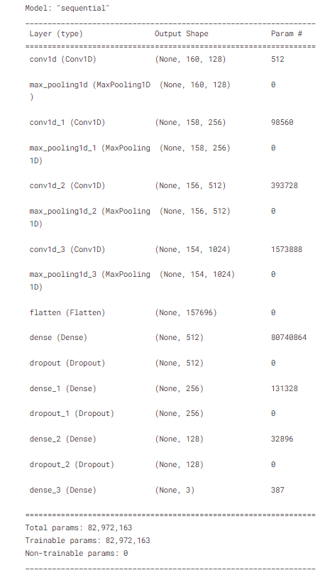
*
Convolutional Neural Network model
*
-  with  Convolutional Neural Network model it has weight (params) total 82,972,163 parameter
    - all parameter are trainable
    
**Traing process**
 
*
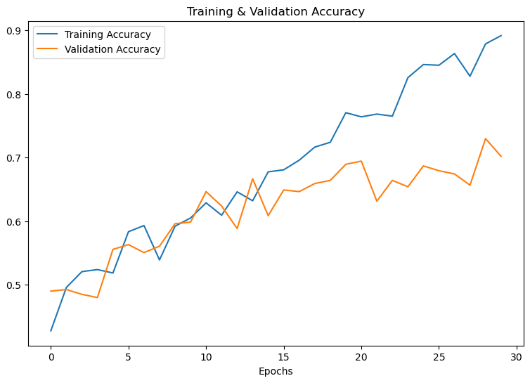
*
with  loss: 1.0762 and accuracy: 0.7020
- Accuracy of our model on test data :  70.20202279090881 %

**Accuracy **
 

*
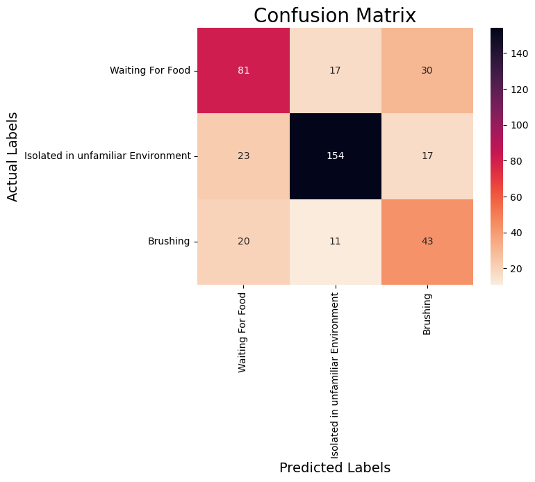
*
- Confusion matrix is a table that is used to define the performance of a classification algorithm. A confusion matrix visualizes and summarizes the performance of a classification algorithm.

- Frome confusion matrix we can calculated 
    - Accuracy = (TPs + TNs) / (TPs+TNs+FPs + FNs)
    - Precision = TPs / (TPs + FPs)
    - Recall = TPs/(TPs+FNs)
    - F1 = 2 x (Precision x Recall)/(Precision + Recall)
*
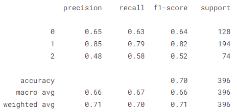
*
 