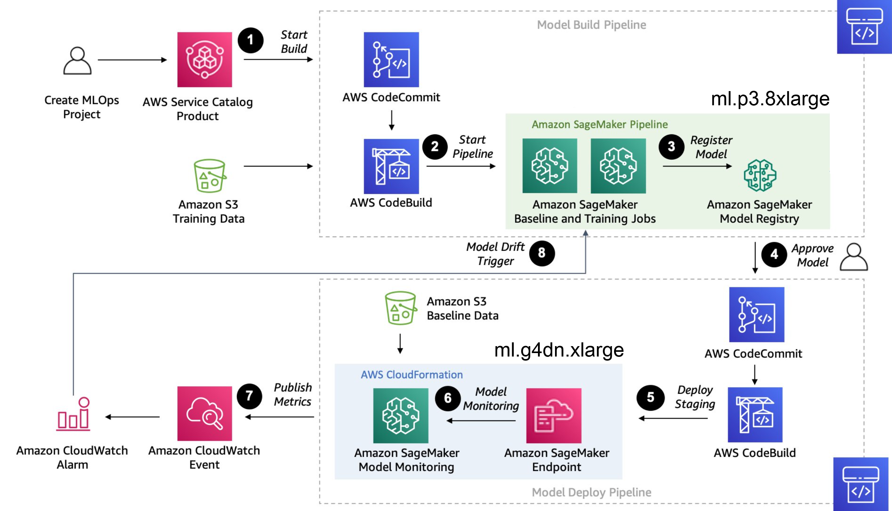
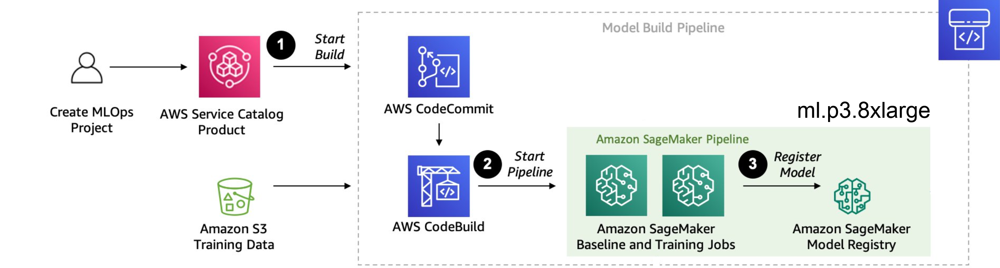
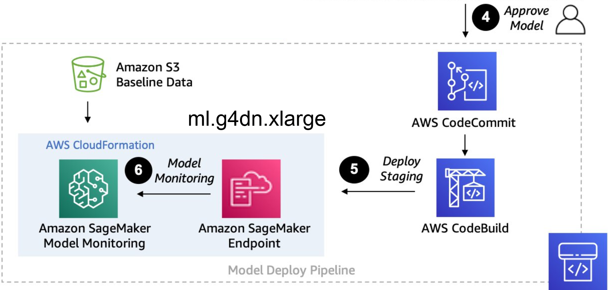
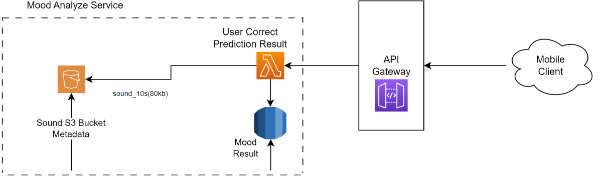
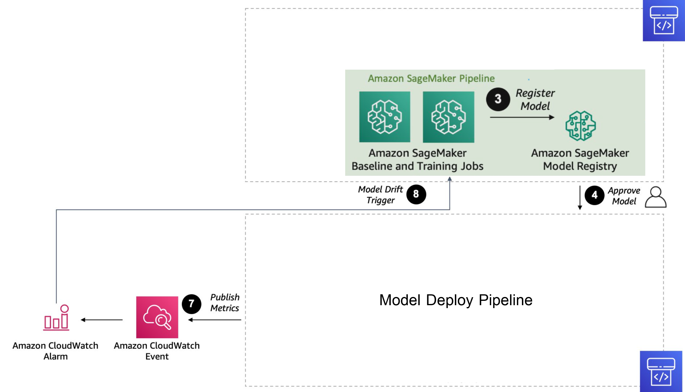

# Machine Learning Pipeline Design Overview:

In our project, we implement a comprehensive Machine Learning (ML) pipeline using Amazon Web Services (AWS) for the creation, training, deployment, and re-training of models
 

## Pipeline flow
 
 
 

 

**Training Process**
 
 

Build model
 

 

<!-- 1. สร้าง Project และทำการสร้าง โครงสร้างของ model ใน AWS  และดึงข้อมูล Training Data set ที่เก็บไว้ใน S3 เพื่อทำการ CodeBuild model ขึ้นมา  -->

1. Creat Project and build sturcture for model in AWS then Commit Code to AWS Load Training Data set in Amazon s3 with codeBuild to Start Pipeline.

<!-- 2.  Start Pipline and train Model ใน Sagemaker Pipeline ที่ run อยู่ใน ml.p3.8xlarge ซึงมี GPU 4 ตัวในการ traing model โดยจะใช้เวลาประมาณ 24hr ในการ train
- โดยจะมี model อยู่ 2 ตัวทำการ train อยู่ใน Sagemaker คือ model ตัวเก่า และ ตัวใหม๋ -->
 
2.  Training Model in SageMaker Pipeline:
- The training process begins with the initiation of the SageMaker pipeline, which orchestrates the training of models. This pipeline operates on an ml.p3.8xlarge instance, equipped with 4 NVIDIA V100 GPUs, each with 16 GB of RAM, totaling 64 GB VRAM. This powerful configuration enables efficient model training. The estimated duration for model training is approximately 24 hours.

- Within the SageMaker environment, we manage two models simultaneously: the existing (old) model and the new ground truth model. This setup allows for the comparison and evaluation of the performance between the two models, facilitating iterative improvements in our machine learning algorithms.

<!-- 3. จะได้ Registry Amazon SageMaker Model ที่ train เสร็จแล้ว -->

3. we will get Registry of Amazon SageMaker Model that are trained,includes details such as model versions, training configurations, evaluation metrics, and other relevant information.

**Deploy Process**
 

 

 
<!-- 4. ทำการ เลือก และ Approve model ที่่ความแม่นยำที่สูง หรือ พอรับได้ commit และ build เพื่อที่จะทำ model ตัวนี้ไป deploy  -->

 4. Model Selection and Approval:
 
- Once a model demonstrates high or acceptable accuracy during evaluation, we proceed to select it for deployment. This selection process involves careful consideration of the model's performance metrics. Upon approval, we commit the chosen model and initiate the deployment process. This involves building the necessary artifacts for deployment, ensuring that the model is ready to be deployed into production.

<!-- 5.  ทำการ deploy ลง  Deploy models for inference endpoint  โดยใช้ instance ml.g4dn.xlarge ซึ่งมี GPU 1 ตัว ในการ run model ตลอด 24hr -->

5. Deployment to Amazon SageMaker Inference Endpoint:
- After selecting a model with satisfactory accuracy, we proceed with its deployment to an Amazon SageMaker inference endpoint. This endpoint is powered by an ml.g4dn.xlarge instance equipped with a single NVIDIA V100 GPU boasting 16 GB GPU RAM. It operates continuously, running 24/7 to serve the inference endpoint, ensuring uninterrupted availability for processing inference requests.

<!-- 6. SageMaker endpoint will have Monitoring model every week or day due to our setting to monitor  accuracy of prediction -->

6. SageMaker endpoint model will be monitored to measure prediction accuracy every weeks or days according to our setting.

   

ground truth

<!-- - หากสิ้งที่ model ทำนายออกมาแล้วไม่ถูกต้อง user จะสามารถแก้ไขได้ โดยจะทำการเก็บสิ่งที่ user แก้ไขให้ถูกต้อง โดย -->
- if model model made incorrect predictions , Users can edit and correct incorrect predictions, saving the corrected data to an S3 bucket.
This corrected data serves as baseline ground truth and contributes to a new dataset for training future models.
<!-- - เป็น base line โดยเราจะใช้สิ่งนี้เป็น ground truth และใช้ เป็น data set ในการ train model ใหม่ -->
 

**Retrain Process**
 

 

<!-- 7. หากความแม่นยำของ model ต่ำเกินค่าที่รับได้ Amazon CloudWatch Event จะทำการ แจ้งเตือน และ Trigger  Pipeline Build model -->
7. If accuracy of model lower then our  threshold , Amazon CloudWatch Event will  alert and  Trigger Pipeline Build model.

<!-- 8. Trigger  Sagemaker Pipeline ที่ run อยู่ใน ml.p3.8xlarge จะทำการ Train model ตัวเก่า และตัวใหม่ โดยใช้  ground truth   ที่ user ทำการแก้ไข เพื่มเป็น data set เพิ่มด้วย  -->
8. Trigger  Sagemaker Pipeline that run in  ml.p3.8xlarge  will use the new ground truth that user has updated to re-training old model and new model.
<!-- - จากนั้นทำ 4 ต่อ -->

 