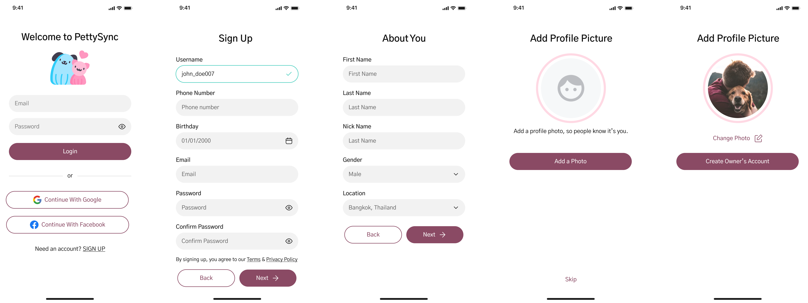
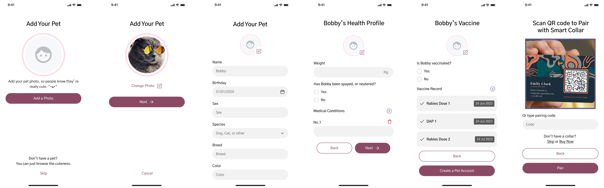
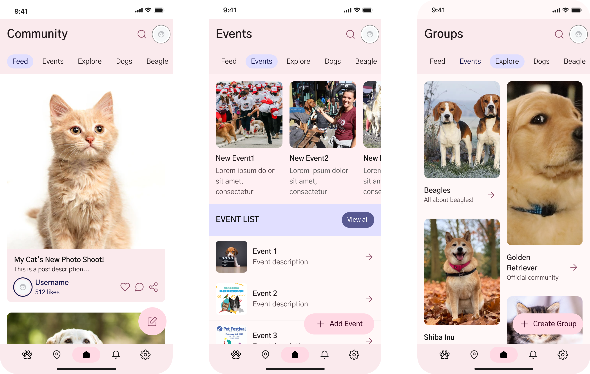
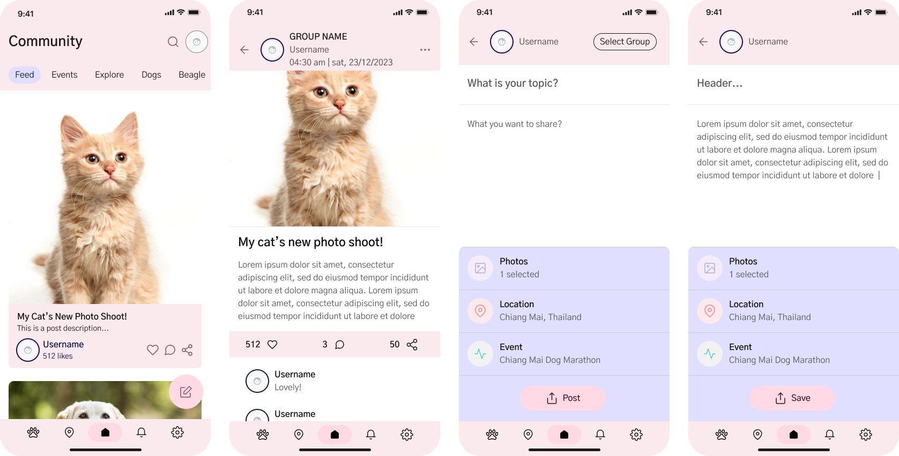
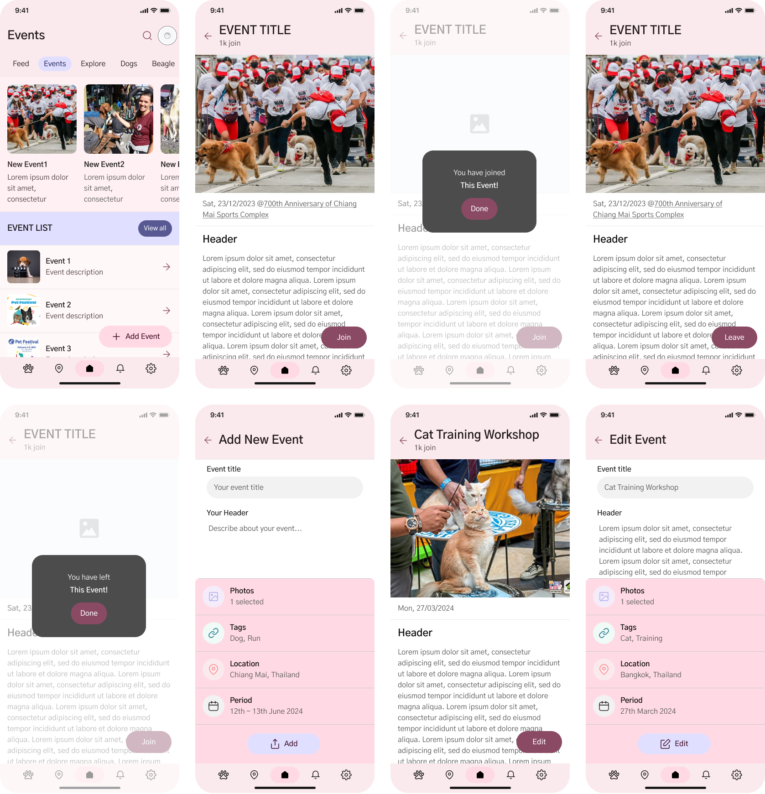
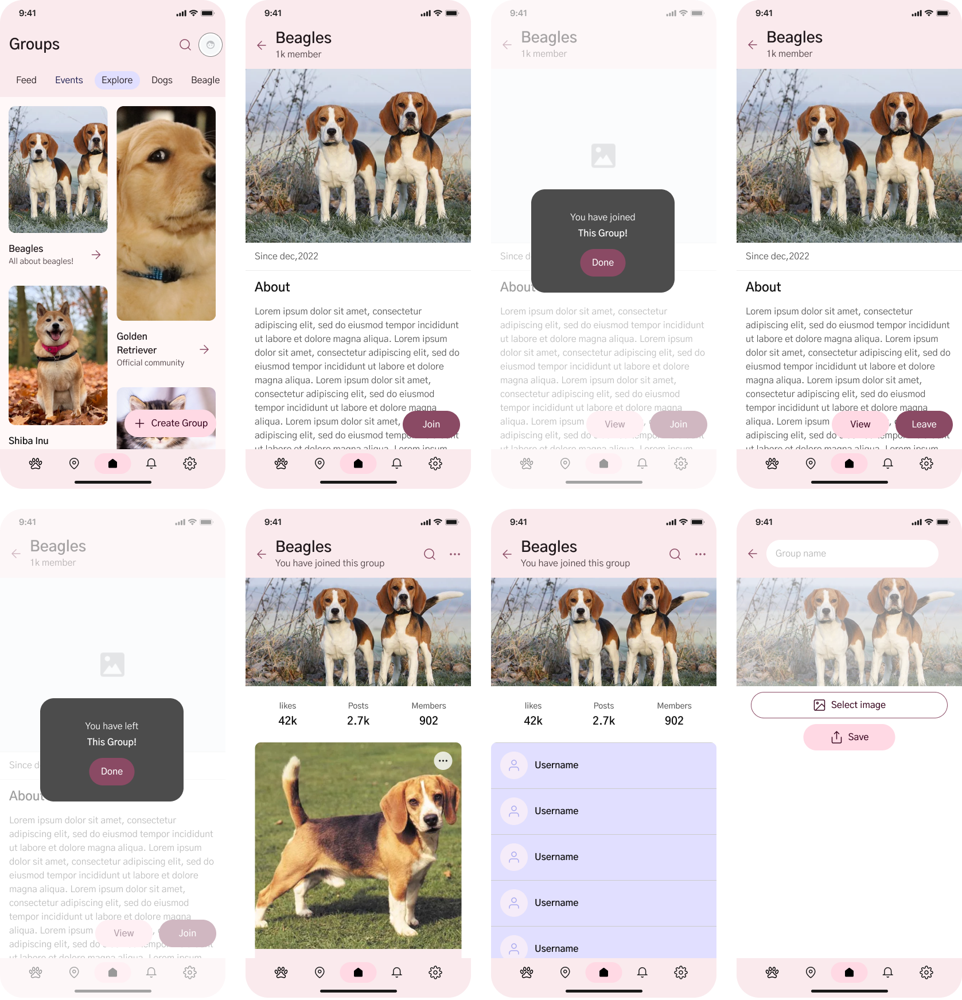
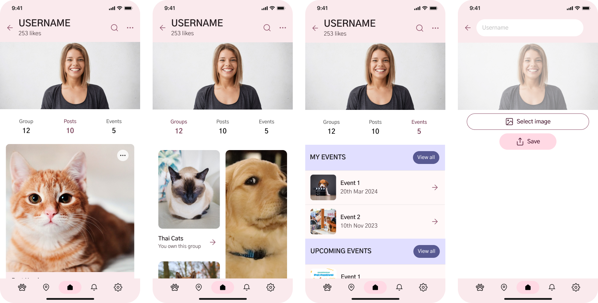

# 📱User Flow 🧒🏻

This page will describe how our users can use the PettyRync mobile application in these sections as follow.

*Section*

- [LOGIN & REGISTER](#login--register)
- [COMMUNITY](#community)
- [PET MAP](#pet-map)
- [PET PROFILE](#pet-profile)
- [NOTIFICATION](#notification)
- [SETTING](#setting)

## LOGIN & REGISTER📝

> Login/Register is the initial part of the user interface, where users can access the application only after creating an account on the application by entering basic personal information.

 

> Once the user has successfully registered or logged in, there is an option to add pet accounts and pair your pet accounts with with the smart collars (using QR CODE or Collar ID), which is optional.

## COMMUNITY🏠

> The second part of the application is the community system, consisting of feed, groups and events related to pets. In a group, one can create posts to share information among group members.

 

> Posts from each group are gathered and displayed in your feed. Users can like, comment, and share posts to their socail media.

 

>Regarding events, there is a section suggesting various events, each with descriptions about the event's topic, location, and schedule. Users can join events (or leave events), and also create their own events.

 

>In the group section, different groups are recommended in groups page. Users can subscribe to many groups, allowing them to view and create posts within those groups. Users can definitely leave any group at anytime.

 

> Each users can also create their own groups too.

 

> Our profile includes all our posts, groups, and events that we have created or joined. While we can view our own profile page, we cannot access profiles of other users.

## PET MAP📍

> In the pet map section, we can view the location of our pets and nearby pets with our smart collars.
 

> There is a function to announce if our pet is missing, which will be displayed on the map for other users.
> Similarly, we can see if other pets are reported missing and notify their owners if found.

## PET PROFILE🐶🐱

>Within the "Pet Profile" segment, the initial section serves as a comprehensive card summarizing each pet's key details. This includes up-to-date health information, the current status of the pet, and the battery status of its smart collar.

 

>Upon entering the card, users gain access to the pet's menu, featuring:
>
> - ***Personal Information:*** Editable details that allow users to input and modify key information about their pet.
> - ***Vaccination History:*** A comprehensive record documenting the pet's vaccination history, aiding in the management of its health.
> - ***Smart Collar Connection:*** This section establishes a direct link to the smart collar adorned by the pet, offering insights and control over the collar's functionalities.
> - ***Health and Activities:*** This part furnishes users with detailed information regarding the pet's well-being. This encompasses aspects like health records, mood indicators, and graphical representations of various activities.

 

> ***Health & Activities:***
>In the dedicated "Health & Activities" section, users gain access to vital data pertaining to each pet's health, meticulously measured by our advanced smart collar technology. If there hasn't been a previous connection with the smart collar, this section remains devoid of data. This segment functions as a comprehensive repository, providing insights into the pet's physical condition and behavioral patterns. It offers a holistic view of the pet's health and activities, ensuring pet owners have a robust understanding of their furry companion's overall well-being. In addition to real-time monitoring, the system allows for the continuous addition of new health records, such as illnesses, treatments, and various activities

 

>Health data of pets will be recorded and stored as a history through graphs while the smart collar is active, which includes:
>
> - ***Mood of the Pet:*** Indicates the pet's mood each time, whether they are happy, hungry, or feeling lonely.
> - ***Heart Rate of the Pet:*** Monitors the pet's heart rate, providing insights into their cardiovascular health.
> - ***Movement and Energy Expenditure:*** Tracks the pet's activity levels and how much energy they expend throughout the day.
> - ***Resting Periods of the Pet:*** Displays the pet's periods of rest, helping to understand their sleep patterns and overall well-being.

## NOTIFICATION🛎

Within  the notification section, there are both consolidated and distinct notification pages is offered, encompassing:

> - ***Pet Alerts:*** Immediate alerts when someone reports encountering your cherished pet or when a nearby pet is declared missing, ensuring swift awareness. Health notifications tailored to your pet's well-being, delivering crucial updates and insights.
> - ***Events:*** A dynamic hub for notifications regarding the latest events, personalized recommendations, and timely alerts as your scheduled events draw near, ensuring you never miss out on exciting happenings.
> - ***Groups:*** Stay seamlessly connected with notifications on novel or suggested groups, coupled with timely alerts pertaining to activities on your posts within a group, fostering an engaged and interactive community.
> - ***Others:*** System-related notifications for other miscellaneous updates and information.

## SETTING⚙️

>In the application settings, users can customize various settings within the app to enhance performance, functionality, or user experience according to their preferences and personal needs. This includes account settings, notification settings, help and support, and about the app.

 

>The account settings page consists of a total of 3 sections, which include the General, About Me, and Groups sections.
>
> - ***General:*** In this section, users can edit information that requires verification, such as username, password, email, phone number, and date of birth. The system will perform checks to prevent the creation of accounts with duplicate information.
> - ***About Me:*** In this section, users can modify personal information such as their name, gender, and current location. This enhances the functionality of the application and aligns it more closely with users' needs, particularly in features like pet finding, which can help users locate others nearby.
> - ***Group:*** In this last section, users can unblock the groups which were previously blocked by them.
