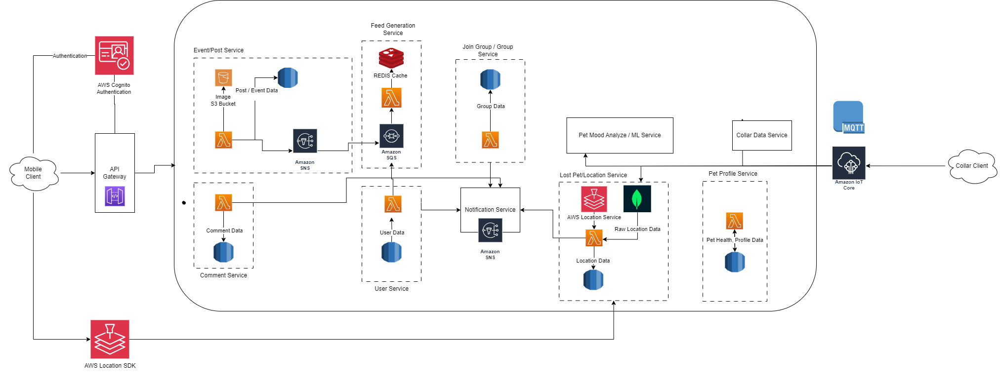
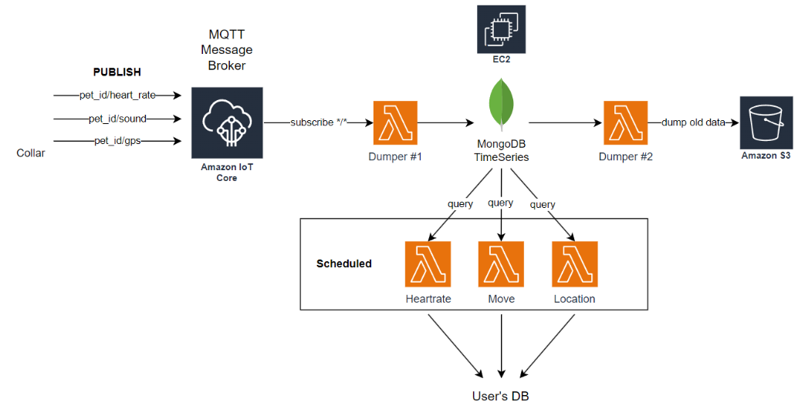
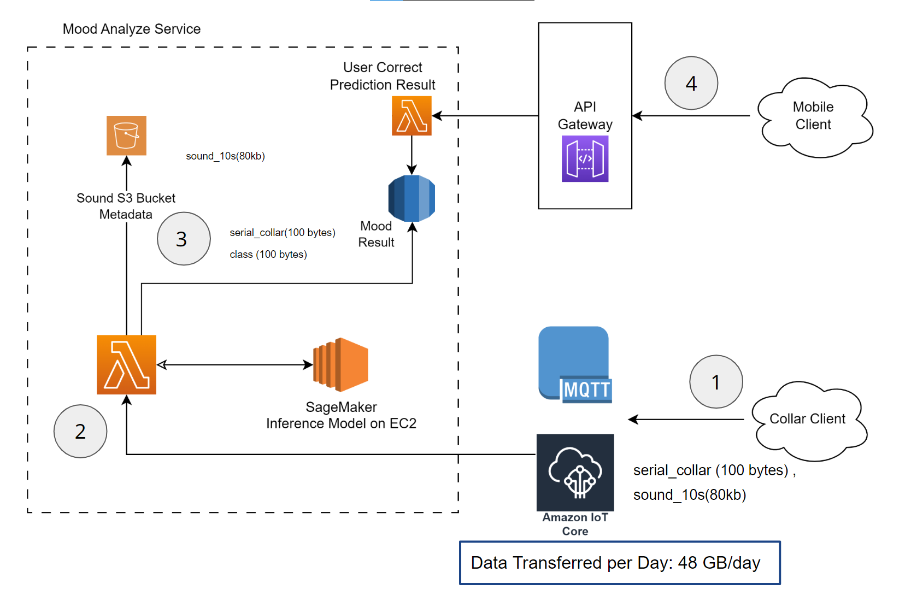
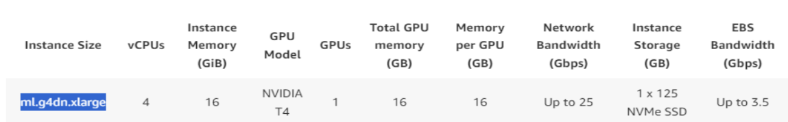
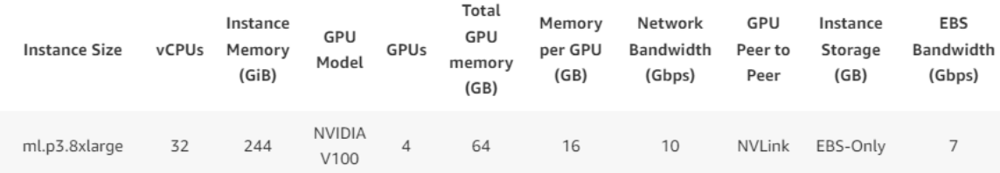

# Cloud Services

The PettySync services both for the community and the pet collar are hosted on the cloud. The cloud services are used to store the data, run the application, and provide the infrastructure for the application. **Amazon Web Services (AWS)** is used for the cloud services. AWS is chosen because it is the most popular cloud service provider and it provides a wide range of services that are required for the application. The development team is also familiar with AWS services.

## Cloud Services for Mobile Application

The above diagram shows the cloud services used for the mobile application. Each service uses a serverless architecture to provide the required functionality. Furthermore, the services are decoupled and can scale independently.

- **Amazon Cognito**: Used for user authentication and authorization.
- **Amazon API Gateway**: Used to create, publish, maintain, monitor, and secure APIs at any scale.
- **AWS Lambda**: Used to run code without provisioning or managing servers and can scale automatically providing high availability and reliability.
- **Amazon RDS**: PostgreSQL database used to store the data.
- **Amazon S3**: Object storage used to store the images and videos.
- **Amazon SNS**: Used to send push notifications to the mobile application and other services.
- **Amazon SQS**: Used to decouple the services and provide a reliable and scalable message queue. This service is used to queue up new posts and events data for feed generation.
- **Amazon Location Service**: Used to provide location-based services, maps, but not tracking. We do tracking using data from MongoDB. Tracking service is too expensive.
- **Amazon Location SDK**: Used to integrate location-based services into the mobile application.
- **REDIS**: Used to cache the data and provide a low-latency access to the frequently accessed data. This is used to cache the feed data for faster feed retrieval.    

## Cloud Services for Pet Collar Data Service

1. **AWS IoT Core**: Used to connect the pet collar and IoT devices to the cloud. It provides a secure and reliable connection between the devices and the cloud. The devices can send the data to the cloud and receive the commands from the cloud through the MQTT protocol.
2. **AWS Lambda**: Used to run the code to process the data received from the pet collar. 
   1. `Dumper #1` validates and processes the data received from the pet collar and stores it in the Mongo DB TimeSeries database.
   2. `Dumper #2` is scheduled to retrieve the data from the TimeSeries database and stores it in the Amazon S3 for long-term storage. The old data is deleted from the TimeSeries database to save the storage space.
   3. `Hearrate`, `Move`, `Location` functions query data from the MongoDB and process it to be able to show on the application UI then store the processed data in the database.
3. **AWS EC2**: It is a virtual machine used to host MongoDB TimeSeries database.
4. **Amazon S3**: Used to store the data received from the pet collar and IoT devices for long-term storage. In the future, we can use the old data from the Amazon S3 for the historical analysis, reporting, and machine learning.
5. **Amazon EventBridge** (Not shown in diagram): Used to schedule AWS Lambda functions to run at a specific time to perform the required tasks.
   1. `Dumper #2` is scheduled to run once in a while to retrieve the data from the TimeSeries database and store it in the Amazon S3.
   2. `Hearrate`, `Move`, `Location` functions are also scheduled to run at a specific time to process the raw data and store it in the User database.

## Cloud Services for Mood Analysis and Machine Learning

We use **AWS SageMaker** to build, train, and deploy machine learning models. The SageMaker provides a fully managed service that covers the entire machine learning workflow to label and prepare your data, choose an algorithm, train the model, tune and optimize it for deployment, make predictions, and take action. Below is the diagram showing the cloud services used for mood analysis and machine learning.

1. Pet collar client sends voice data to the AWS IoT Core using MQTT protocol.
2. AWS IoT Core sends the voice data to the AWS Lambda function. AWS Lambda function forwards it to SageMaker Inference Model hosted on Amazon EC2 to get the mood analysis result.
3. AWS Lambda function receives the mood analysis result from SageMaker Inference endpoint and stores the result in the database. It also sends the voice to Amazon S3 to be used for retraining the model. The mood result table is composed of the following columns:
   1. `id`: The unique identifier of the mood analysis result.
   2. `user_id`: The unique identifier of the user.
   3. `mood`: The mood analysis result.
   4. `created_at`: The date and time when the mood analysis result is created.
   5. `updated_at`: The date and time when the mood analysis result is updated.
   6. `voice_id`: The unique identifier (S3 Object key) of the voice data.
   7. `is_corrected`: A flag to indicate if the mood analysis result is corrected by the user.
4. User can access the mood analysis result from the mobile application and can correct the result if it is wrong. The corrected data is used to retrain the model.

### Cost Estimation

#### Assumptions

- The cost is calculated based on the AWS pricing in the Asia Pacific (Singapore) region.
- Daily active users: 28,000
- Each user has a pet collar device.
- Each collar device sends a message every 5 minutes. Message size is 182 bytes.
- Each user uploads a post per day.
- A post contains an image or a video of size 10 MB.
- Assume, there are 100,000 read requests per day for each service.
- Database utilization is almost 100%.
- The cost of the database is calculated based on the Amazon RDS pricing for PostgreSQL database.
- The cost of the storage is calculated based on the Amazon S3 pricing.
- The cost of the API Gateway is calculated based on the number of requests and the data transfer out. Assume, 1 million requests per day.

#### Estimated Cost

Total is 7227.1 USD per month, or about 260,000 baht/month, roughly 3,000,000 baht/year. The most expensive cost is the database, especially AWS S3 for media storage and Amazon ElastiCache (REDIS)

More details from AWS Pricing Calculator: https://calculator.aws/#/estimate?id=a1410261540bae4c73d5de057192bb53281671a7

#### SageMaker Operation Cost

We use `ml.g4dn.xlarge` instance for inference. It has 4 vCPUs, 16 GiB memory, and 1 GPU with 16 GB vRam. The cost of the instance is $0.736 per hour. We use the instance for 24 hours a day, 30 days a month. The monthly cost of the instance is $529.92, or about 19,000 baht/month.

#### SageMaker Training Cost

We use `ml.p3.8xlarge` instance for training the model. It has 32 vCPUs, 244 GiB memory, and 4 GPUs with 64 GB vRam. The cost of the instance is $12.24 per hour. Suppose we train the model for 24 hours a day, 1 day a month. The monthly cost of the instance is $293.76, or about 10,000 baht/month.

## Monitoring and Logging

We use **Amazon CloudWatch** to monitor the application and the cloud services. CloudWatch provides the logs and metrics for the application and the cloud services.

## Amazon RDS Multi-AZ Deployment

We use **Amazon RDS** for the PostgreSQL database. Amazon RDS Multi-AZ with one standby replica is used to provide high availability and failover support for the database. The standby replica is used for disaster recovery and to minimize the downtime during the maintenance. The primary database is synchronously replicated across Availability Zones to the standby replica to provide data redundancy, failover support, and to minimize latency during system backups.