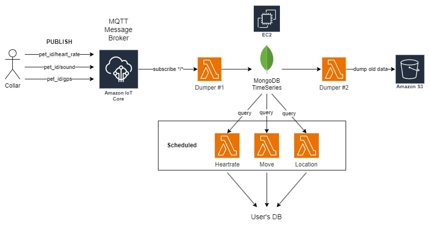

# SYSTEM DESIGN

## Collar Data Service

This service will handle MQTT request from each collar via [Amazon IOT Core](https://aws.amazon.com/iot-core/).
Then we will have a lambda *Dumper #1* that will check if data is corrupted or not then dump to MongoDB 
TimeSeries collection (the instance is hosted on AWS EC2). 

Next, we will have lambda (*Heartrate*, *Move*, *Location*) scheduled to query data from the MongoDB and process it to be able to show
on the UI then we will send it to users's database.

The last component is *Dumper #2* that will pull old data from MongoDB to store on AWS S3.
