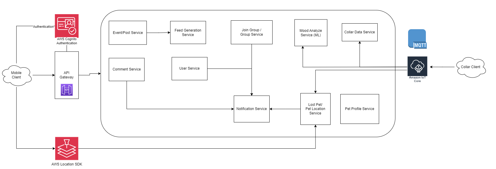

# HIGH LEVEL DESIGN

## Capacity Estimation and Constraints

### Traffic Estimates

There are about 2.8 million pets in Thailand. Suppose 1% of the pet owners use the application. That would be 28,000 users.

### Storage Estimates

Suppose each user uploads 1 image/video per day. That would be 28,000 images/videos per day.
Assuming each image/video is 10 MB, that would be 280 GB of data per day. That would be 102 TB of data per year.

## Design Consideration

1. Our application is read-heavy. We need to optimize for read operations. We can use a NoSQL database for this. We can use a relational database for the user data. We can use a cache for caching the images/videos. We can use a message queue for handling the requests asynchronously.
2. Our application needs to support both iOS and Android. We can use a cross-platform framework like Flutter for this. We use Flutter because it is fast and it uses Dart which is a modern language and supports both strong and weak typing allowing for faster development.

## System Architecture

Microservices architecture is used for the system because it is scalable, maintainable, and testable. It helps us separate the concerns between the Community features and the Pet Collar features as they use different technologies. Importantly, each service can scale indepedently without tight coupling. The diagram below shows the high-level architecture of the system.

### 1. User Service

This service is responsible for user management. It includes user profile management, and retrieval of user data, including user images and videos. 

### 2. Group Service

This service is responsible for group management. It includes group creation, group joining, and group browsing.

### 3. Event/Post Service

This service is responsible for event and post management. It includes event creation, event browsing, and post creation, post deletion, and post liking. This service also handles image and video uploaded along with the posts.

### 4. Pet Profile Service

This service is responsible for pet management. It includes pet profile management, pet health monitoring, and pet vaccination record.

### 5. Comment Service

This service is responsible for comment management. It includes comment creation, comment deletion, and comment liking on posts.

### 6. Feed Generation Service

It includes generating the user feed based on the user's joined groups and trending posts. It also handles groups and events feed generation and recommendation for the user.

### 7. Notification Service

This service is responsible for sending notifications to the user. It includes notifications for new comments, new likes, new posts, and lost pets reported by other users.

### 8. Mood Analysis Service (Machine Learning Service)

This service is responsible for analyzing the mood of the pet based on the voices sent from the collar. It uses machine learning to analyze the mood of the pet and stores the voices data for further model retraining.

### 9. Lost Pet/Pet Location Service    

This service is responsible for lost pet management. It includes lost pet reporting, lost pet browsing, and pet location tracking.

### 10.  Collar Data Service

This service is responsible for managing the data from the pet collar. It includes pet location tracking, and pet health monitoring. This raw data is processed and stored in the database to be shown on the application. 

### 11. Authentication Service

This service is responsible for user authentication. It includes user login, user registration, and user password reset.
